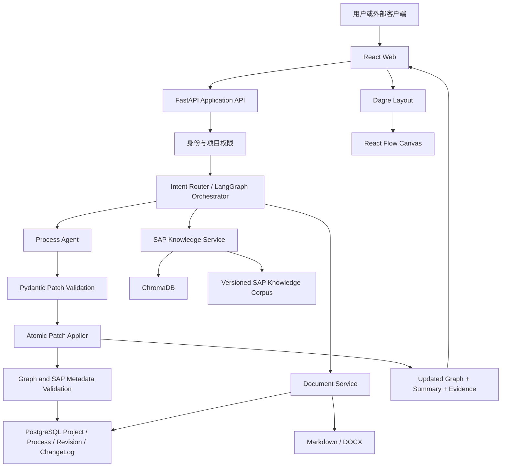

# SAP Blueprint AI Agent 实施规格

> 文档状态：整合实施与 Agent 编排验收基线 3.4
>
> 实施状态校准：2026-08-09（以当前代码与自动化测试为准）
>
> 整合来源：当前仓库实现、原《智能流程图 Agent 实施规格》与《SAP Blueprint AI Agent 产品架构与实施方案计划书 V1.0》Markdown 版
>
> 目标读者：产品负责人、SAP 顾问、前端工程师、后端工程师、测试工程师、部署人员
>
> 产品范围：首期聚焦 SAP MM 采购到付款（P2P），保留通用流程图编辑底座
>
> 计划周期：12 周；以当前可运行基线为起点重新排期

## 1. 文档目的与统一结论

本规格是后续开发、接口、数据模型、测试和验收的唯一实施基线。新需求不另起一套流程图系统，而是在当前 React Flow、原子 Patch、泳道、图标、历史记录和导出能力之上，扩展为面向 SAP 实施蓝图的智能 Agent。

整合后固定以下原则：

1. 当前 `GraphDocument` 继续作为画布和 Agent 操作的核心领域模型，不使用数据库行直接替代图模型。
2. LLM 只能提出结构化 Patch，不能直接覆盖完整流程图、写数据库或生成永久 ID。
3. 流程图形状类型与 SAP 业务步骤类型分开建模，不能用 `transaction / approval / validation` 替换 `start / task / decision` 等图形语义。
4. 节点、连线、泳道、图标、布局和 SAP 元数据必须能够一起保存、恢复、版本化和导出。
5. AI 只能提出 GAP 候选，必须由顾问确认后才能成为正式 GAP。
6. 所有 AI 生成的 T-Code、Fiori App、配置点、BAdI 和 GAP 建议必须带知识来源；未检索到可靠证据时标记为“待确认”。
7. 不存储或展示模型内部推理过程，只保存简短决策摘要、结构化 Patch、知识引用和执行结果。
8. 当前 React 19 和自定义样式继续使用，不降级 React，也不在本阶段整体迁移到 Ant Design。

### 1.1 新版说明合并结论

新版《SAP Blueprint AI Agent 产品架构与实施方案计划书 V1.0》描述了产品目标和 12 周方向，但部分技术建议与当前已运行项目不一致。整合时以“保留已验证能力、补齐 SAP 蓝图闭环、生产风险显式验收”为原则，处理如下：

| 新版说明项 | 与当前项目的差异或问题 | 统一实施结论 |
| --- | --- | --- |
| React 18 + Ant Design | 当前项目已使用 React 19 和自定义设计体系，整体迁移会扩大回归范围 | 保留 React 19 和现有组件样式；SAP 功能完善期间不迁移 UI 框架 |
| LangGraph 在早期直接接管流程 | 当前原子 Patch、Provider 和应用服务已形成稳定闭环，编排层不能重新拥有领域校验、ID 或事务 | Tool、权限、知识和持久化契约稳定后引入 LangGraph；仅编排请求级条件分支，继续复用原子 `LLMPatch`、证据门禁和 Repository 事务 |
| 模型生成完整 React Flow JSON | 完整替换会破坏永久 ID、布局、泳道、历史和并发控制 | LLM 只生成原子 `LLMPatch`，由服务端校验、分配 ID、执行和保存 |
| `process_node` 作为图的权威表 | 与当前完整 `GraphDocument` 快照双写时容易不一致 | V1.0 以 `ProcessRevision.graph_json` 为权威；节点表仅在后续跨流程分析需要时作为投影 |
| 数据库草案只定义项目、流程和节点 | 缺少连线、泳道、编辑修订、发布版本、成员权限和 GAP 决策审计，无法支撑当前完整闭环 | 采用当前 `Project / Process / ProcessRevision / ChangeLog / GapDecision / ProjectMember` 模型；完整图随修订保存，不按新版草案缩减 |
| ChangeLog 保存 `ai_reasoning` | 原始推理可能包含敏感业务信息，也不属于可验收的决策证据 | 不保存模型内部推理；只保存脱敏后的用户意图摘要、结构化 Patch、知识引用、执行结果和请求号 |
| WebSocket / REST | MVP 不需要为一次性修改维护双通道 | REST 为默认协议；只在长任务状态展示时增加 SSE，不把 WebSocket 列为 V1.0 必需项 |
| OpenAI / Claude 为默认模型 | 当前仓库已有 Local Rule 和 DeepSeek Provider | 继续使用 Provider 抽象；模型供应商不能进入 Patch、权限或持久化核心逻辑 |
| RAG 自动匹配和 GAP 识别 | 原说明缺少授权、版本、证据和人工确认边界 | 生产只索引授权且审核通过的知识；专业结论必须带证据，AI 只能创建 GAP 候选 |
| `UpdateFlowNodeInput` 只定义节点增改删 | 产品闭环同时要求 Process Agent 修改节点和连线，且当前项目已经把泳道作为一等图对象；仅保留节点 Tool 会导致“增加泳道”误增节点，也无法自然语言维护连线 | `update_flow` 统一输出节点、连线和泳道的原子 Patch；三类对象都必须覆盖自然语言与画布/Inspector 的增改删，并分别做意图匹配和验收 |
| 顾问人效提升 30% 至 50% | 缺少真实项目前后测基线 | 保留为产品指标假设，不作为首轮技术验收的直接结论 |
| 外部模型处理项目数据 | 原说明未定义项目授权、脱敏和审计 | 默认禁止项目调用外部模型；仅项目管理员可显式开启，调用前脱敏，策略变更必须审计 |
| 12 周计划按绿地项目编排 | 当前仓库已经完成脚手架、画布、Patch、泳道、布局和大量 SAP 蓝图能力，照搬会重复建设且掩盖生产化缺口 | 以当前代码作为 Week 0 基线，按知识治理、权限、持久化、导出和交付风险重新排期，并用勾选状态区分已完成与待验收 |
| 新版方案缺少生产验收定义 | 未明确事务原子性、跨项目权限、备份恢复、SSO、日志脱敏、依赖安全和多视口验收 | 将这些项目写入测试章节、Definition of Done 和最终验收清单；未在真实环境验证的项目不得标记完成 |

后续需求若与本表结论冲突，必须先更新本实施规格和验收条件，再进入代码实现。

## 2. 产品定义

### 2.1 建设目标

构建一个面向 SAP 实施顾问的业务蓝图智能 Agent。用户通过中文自然语言创建和修改结构化流程，系统结合经过治理的 SAP 知识库，为节点补充 T-Code、业务角色、配置点、Best Practice 引用和 GAP 候选，并生成可审阅、可追溯、可版本化的蓝图文档。

“顾问人效提升 30% 至 50%”作为产品假设，需要通过真实项目基线测量验证，不作为首个技术版本的直接验收结论。

### 2.2 目标用户

- SAP MM 实施顾问：梳理 P2P 需求、匹配标准流程、确认 GAP 并输出蓝图。
- 业务分析师和关键用户：参与流程确认，补充业务规则、角色和审批条件。
- 项目负责人：管理项目、流程版本、审批状态和交付物。
- 开发与集成人员：通过 API 调用结构化流程修改、知识检索和文档导出能力。
- 运维与安全人员：部署内部实例，管理模型密钥、数据保留和审计策略。

### 2.3 V1.0 必须形成的业务闭环

1. 创建项目和 MM/P2P 流程。
2. 通过自然语言或画布操作生成、增加、删除、修改节点、连线和泳道。
3. 在属性面板维护节点的 SAP 元数据。
4. 从受控知识库检索 J45 等 Best Practice 内容，并把引用附加到节点。
5. 基于业务要求和标准能力生成 GAP 候选。
6. 由顾问确认、驳回或解决 GAP 候选。
7. 保存编辑修订，发布不可变的蓝图版本。
8. 导出 Markdown 和 Word 蓝图，包含流程图、节点清单、SAP 元数据、知识引用和 GAP List。

### 2.4 V1.0 范围

必须交付：

- SAP MM 采购到付款（P2P）场景，首批知识范围覆盖经审核的 J45 资料。
- React Flow 画布以及开始、结束、任务、判断和子流程节点。
- 横向、纵向泳道，节点语义图标和节点归属管理。
- 文本指令驱动的多轮增量修改。
- 原子 Patch、图结构校验、撤销、重做和本地恢复。
- SAP 元数据编辑、检索建议、证据查看和待确认状态。
- GAP 候选识别及人工确认流程。
- 项目、流程、编辑修订、发布版本和变更日志持久化。
- JSON、PNG、SVG、Markdown 和 Word 导出。
- Local Rule Provider 和 DeepSeek Provider；保留扩展其他模型的接口。
- Docker Compose 单机或团队内部部署。
- 中英文错误结构，首版 UI 默认中文。

可选交付：

- SSE 展示 `accepted`、`retrieving`、`calling_model`、`validating`、`persisting`、`completed` 状态。
- 浏览器 Web Speech API 语音转文字。
- 受限 BPMN 2.0 XML 导出。
- Python SDK 和 CLI。

### 2.5 明确不做

- V1.0 不直接连接客户生产 SAP 系统，也不读取生产业务数据。
- V1.0 不扩展到 SD、FI、PP 等完整模块知识库。
- V1.0 不支持多人实时共同编辑同一流程。
- V1.0 不把 AI 判断自动标记为已确认 GAP。
- V1.0 不承诺任意流程可无损转换为完整 BPMN。
- V1.0 不使用未经授权的 SAP 文档建立知识库。
- 不允许浏览器持有模型 API Key。
- 不展示或保存模型内部思维链。

## 3. 当前实现基线

### 3.1 已完成并继续复用

- React 19、TypeScript、Vite 和 `@xyflow/react` 画布。
- 开始、结束、任务、判断和子流程五类标准流程形状。
- Dagre 横向、纵向自动布局。
- 节点语义图标。
- 可创建、改名、改色、删除并持久化的横向/纵向泳道。
- 节点拖放归属泳道，以及自然语言泳道操作。
- FastAPI、Pydantic 严格模型和原子 Patch Applier。
- 节点、连线和泳道的结构化增改删 Patch；连线标签更新保留永久 ID 和端点，端点重连使用原子删除加新增。
- `GraphDocument 2.0`、SAP Context、节点 SAP 元数据和 1.0 到 2.0 的自动迁移。
- T-Code、Fiori App、业务角色、配置点、Best Practice 引用和 GAP 状态模型。
- Local Rule Provider 和 DeepSeek Provider。
- DeepSeek 单次/总时限、瞬时错误分类重试和指数退避；认证及永久 4xx 不重试，Provider 错误不包含上游响应正文。
- MM/P2P 五泳道示例，以及 SAP Inspector、证据和 GAP 候选交互。
- 本地 `SAP_Knowledge` Markdown 语料、版本过滤、证据返回和 GAP 候选分析 API。
- SQLAlchemy 项目、流程、修订、ChangeLog、GapDecision 和 ExportJob 持久化，以及 SQLite 开发适配器、Alembic 迁移和 PostgreSQL Compose 服务。
- Repository 所有写入统一捕获数据库异常并显式回滚；一般写入故障返回不暴露底层细节的 `DATABASE_WRITE_FAILED`（503），修订唯一键冲突继续返回 `REVISION_CONFLICT`（409）。
- `ProjectMember` 服务端成员模型、Alembic 迁移和成员管理 API；项目创建者自动成为 `project_admin`，项目角色从服务端成员记录解析。
- 项目、流程、修订、发布、导出、GAP 和成员接口的角色门禁；非成员访问隐藏为 404，角色不足返回 403，最后一个项目管理员不能被降级或删除。
- 仅 `project_admin` 可见的前端成员管理弹窗，支持成员列表、新增、角色修改、删除、最后管理员保护和移动视口适配。
- 生产环境 Bearer JWT 验证基础：通过 OIDC/JWKS 校验非对称签名、issuer、audience、有效期和稳定用户 claim，生产环境忽略 `X-User-ID`。
- 前端 OIDC Authorization Code + PKCE 登录、回调 URL 清理、退出、`sessionStorage` 会话和全 API Bearer Token 注入；未配置 OIDC 时保持本地开发模式，配置不完整时阻断并显示明确错误。
- API 单行 JSON 请求日志、可信 `X-Request-ID`、路由模板/状态/耗时记录、通用异常安全响应和全响应请求号；不记录查询、认证头、Cookie、请求正文或上游异常正文。
- 校验错误移除原始 `input`/`ctx`，认证 Token/API Key/JWT 与业务敏感字段统一脱敏；CI 执行 Python/Node 依赖审计和生产源码/前端构建秘密扫描。
- 项目级外部模型默认关闭策略、管理员开关、0004 迁移、策略审计 API、禁用时本地回退以及模型请求体/ChangeLog/GAP 脱敏。
- 管理员成员弹窗中的“仅本地 / 允许调用”开关、数据外发二次确认、状态回写和 390 x 844 移动端适配。
- 无项目上下文的流程修改、全局知识检索和全局 GAP 分析接口在非开发环境隐藏为 404；OIDC/Provider 未配置或数据库不可连接时 readiness 返回 503。
- 项目级知识检索和 GAP 分析接口；全局知识接口仅保留给本地开发演示。
- 版本化 Markdown chunk、内容哈希、ChromaDB 持久化集合和离线字符 n-gram 向量/词法混合召回；索引重建会清理陈旧 chunk。
- 固定知识自动化评估集，覆盖 13 个检索案例和 8 个 GAP 正反例，并设置检索状态、Top-1 来源、证据来源、GAP 规则引用和结果质量门槛。
- 持久化流程修改会自动检索项目知识，把证据传给 Provider、返回前端并写入 ChangeLog；未知证据引用、无批准证据的 `verified` 元数据和无证据 GAP 会在保存前被拒绝。
- LangGraph `ProcessAgentOrchestrator` 请求级条件路由：先区分纯画布结构修改与 SAP 专业修改；泳道、连线、图标和布局等纯结构指令跳过知识检索，SAP/T-Code/Fiori/配置/BAdI/Best Practice/GAP 指令进入知识检索、证据不足标记、Provider 策略、Patch 生成、证据校验和待确认分支。
- LangGraph `DocumentAgentOrchestrator` 导出预检与 Markdown/DOCX 渲染路由：发现未验证 SAP 元数据、无引用 Best Practice 或候选 GAP 时标记 `pending_confirmation`，但不替代发布门禁，也不把导出结果误标为顾问签字版本。
- 发布前图结构、项目/流程/SAP Context 必填字段、专业元数据证据和 GAP 人工决策审计校验。
- 前端按服务端 `current_role` 控制查看者、编辑者和审批者能力；查看者可查看和导出，但不能编辑、布局、导入、操作泳道或发布。
- Zustand 历史记录、撤销、重做和浏览器本地恢复。
- JSON 导入导出、PNG 和 SVG 全图导出。
- 项目、流程、修订、发布版本和从发布版本创建草稿的 API 及前端工作流。
- 前端 API 请求自动附带 `X-Request-ID`；流程修改请求的请求头与请求体请求号一致，便于跨端日志定位。
- 前端普通 API 40 秒、异步导出创建/轮询/下载全流程 44 秒统一截止时间；用户取消保持 `AbortError`，客户端超时返回 `REQUEST_TIMEOUT`，修订冲突提示先导出 JSON，三类失败均保留当前图和原指令。
- Markdown / Word 蓝图导出，共用 `BlueprintDocumentModel`，包含流程图、泳道、节点清单、SAP 元数据、证据和 GAP List。
- Markdown / Word 浏览器下载支持中文流程标题、修订号和时间戳文件名；两种格式的节点、版本和 GAP 内容一致性已纳入自动化回归。
- 持久化异步导出任务和 `export_id` 查询/下载：状态覆盖 `pending`、`running`、`completed`、`failed`、`expired`，支持数据库原子抢占、陈旧任务恢复、失败安全响应、到期内容清理和项目查看者权限校验；同步导出接口仅保留兼容用途。
- Docker、Docker Compose、Nginx 和 GitHub Actions 基线；API 镜像已复制 `SAP_Knowledge` 和 Alembic 文件，并以非 root 用户运行。
- Docker 构建上下文通过 `.dockerignore` 排除秘密、依赖、输出和原始说明书；Compose 强制提供 PostgreSQL 密码，API 8000 端口只在容器网络暴露，Web 以数据库感知的 readiness 做端到端健康检查，API/Web 镜像使用可由 `SAP_FLOW_IMAGE_TAG` 覆盖的稳定名称。
- GitHub Actions 独立 `deploy` 验收作业已在干净 Ubuntu runner 构建 Compose 镜像、启动 PostgreSQL/API/Web、校验数据库 readiness 和 Alembic `20260809_0005 (head)`，再执行 `pg_dump`、恢复到独立数据库并核对迁移版本。
- 前后端自动化测试基线，以及迁移、导出结构和典型项目闭环的回归覆盖。
- 可自行分配端口并启动当前 API、Web 和隔离 SQLite 数据库的 Playwright CLI smoke；覆盖本地撤销/重做/自动布局/刷新恢复、泳道不误增节点、成员 CRUD、外部模型二次确认与审计、取消/超时/修订冲突恢复、本地 Patch P95、持久化修改/发布/历史回看/新草稿、管理员/查看者权限、异步 Markdown/Word 下载和三种视口。
- 版本化 MM/P2P 验收场景和 PowerShell API 演示脚本；可重复完成项目创建、Agent 建图、连线修改、发布、创建两个持久化导出任务并下载双格式蓝图，输出包含两个 `export_id` 的验收摘要。

### 3.2 尚未完成

- 具体身份提供方和 PostgreSQL/Docker 环境的跨环境浏览器回归仍需扩展；当前 SQLite 隔离环境已覆盖持久化修改、发布、回看、新草稿、成员 CRUD、外部模型策略、查看者权限、蓝图下载失败、核心权限矩阵、跨项目访问和发布预检。
- 知识库授权审核、顾问正式标注与质量门槛评审、生产语义嵌入模型选型尚未完成；当前已有固定自动化评估集，但 ChromaDB 仍使用离线可重复的字符 n-gram 哈希向量，不宣称具备完整语义 RAG 质量。
- 具体 SSO/OIDC 身份提供方的客户端注册、真实登录/退出联调和租户级隔离尚未完成；通用 SPA PKCE 与 Bearer Token 接入已完成，`X-User-ID` 仅保留在开发环境。
- 容器基础镜像和操作系统包 Trivy 扫描、CycloneDX SBOM 和可修复 Critical 门禁已接入部署 CI；未修复发现仍保留在日志/构件中。集中日志采集/保留策略、告警规则和生产日志平台联调尚未完成；应用级请求/异常/审计脱敏与秘密扫描已具备自动化红线测试。
- Python SDK、CLI 和 BPMN 导出。
- 当前后台导出执行仍依赖 FastAPI 进程内 `BackgroundTasks`，导出二进制暂存应用数据库；尚未引入独立任务队列、Worker 和对象存储，因此不能把当前实现视为高并发、多实例或永久文档存储方案。
- 当前机器无 Docker CLI，不能提供本机 Compose 实跑证据；镜像 build/up、PostgreSQL readiness、迁移及备份恢复已由 GitHub Ubuntu runner 验收通过，中文字体和 DOCX 排版仍需带 LibreOffice 的目标环境单独验收。
- 生产备份、恢复、迁移和 readiness 操作已写入 `deploy/OPERATIONS.md`，真实卷归档与恢复演练仍需 Docker 环境。
- 真实外部模型和 PostgreSQL 环境的并发、长尾性能、缓存命中率与容量压测尚未完成；当前只证明本地 Patch 20 次采样 P95 小于 1 秒。

### 3.3 当前整合切片的验收状态

本轮已完成“数据契约 + SAP 业务上下文 + 受控知识建议 + 持久化与文档导出基础”，但仍保留生产化边界：

- 已可验收：节点、连线和泳道均覆盖自然语言与画布/Inspector 增改删；连线支持 `add_edge`、`update_edge` 和 `remove_edge`，标签更新保留永久 ID 和端点，`viewer` 只能查看连线属性。
- 已可验收：旧图无损迁移到 2.0、P2P 五泳道示例、SAP Inspector 元数据维护、证据/待确认标识、本地知识检索、项目级知识/GAP 查询权限、GAP `candidate` 输出、GAP 人工决策审计、修订冲突、发布快照复制、Markdown / Word 异步导出。
- 已可验收：导出任务状态和文件内容持久化，查看者可创建、查询和下载自己有权访问流程的导出；失败、过期、跨流程查询和未完成下载返回稳定错误，默认保留 24 小时，运行超过 5 分钟的陈旧任务可重新抢占执行。
- 已可验收：知识库故障、Provider 故障和 DOCX 渲染故障均返回安全错误，当前图和持久化修订保持可用，失败请求不新增 ChangeLog。
- 已可验收：前端主动取消、客户端超时和 `REVISION_CONFLICT` 均不改变图或服务端修订，原指令保留；超时后直接重试可正常进入发布生命周期。
- 已完成典型闭环：创建项目 → 创建流程 → AI 生成流程 → 保存修订 → 发布版本 → 从发布版本创建新草稿 → 历史修订只读回看。
- 当前发布预检可阻断项目/流程/图标题、模块、流程范围和 SAP Context 缺失，阻断无节点、无开始/结束节点、无证据的 `verified` 元数据，以及缺少最新人工决策审计、缺少历史 `confirmed` 审计或缺少证据引用的正式 GAP。
- 当前权限实现已从服务端 `ProjectMemberRecord` 解析项目角色，不再信任客户端 `X-Project-Role`；开发环境缺省身份为 `local-user`，生产环境只接受通过 OIDC/JWKS 校验的 Bearer JWT。前端已具备 SPA PKCE 登录、回调、退出和 Token 注入，具体身份提供方客户端注册及部署联调完成前，仍不能视为完整生产认证方案。
- 当前知识检索已使用 ChromaDB 持久化索引和向量/词法混合排序；开发环境允许待审核种子并保持待确认标识，生产环境只索引授权且顾问审核通过的语料。固定自动化评估集已完成，顾问正式标注、质量门槛签字和生产语义嵌入模型仍待完成。
- 当前离线混合检索要求最高候选分数至少达到 0.30，达到门槛后保留同一查询的相关支持证据；PP 生产订单和 SD 退货开票等近邻负例必须返回证据不足。GAP 规则除模块外还必须与流程范围和 SAP Release 一致，禁止跨范围或跨版本套用候选规则。
- 当前 LangGraph 只编排请求级状态：纯泳道/连线/图标/布局修改不再依赖知识服务，SAP 专业修改保留检索、证据不足、外部模型策略、原子 Patch、证据校验和待确认分支；编排成功后才由现有 Repository 保存修订和 ChangeLog。文档导出增加待确认预检分支，渲染仍复用同一 `BlueprintDocumentModel`。
- 当前部署配置已具备稳定镜像命名和可重复的 Compose/PostgreSQL 验收作业；远程 `deploy` 作业已验证干净构建、启动、readiness、迁移、备份和恢复。

### 3.4 本轮验证记录（2026-08-09）

- 后端 `ruff check .` 通过，pytest 91 项通过，包含 LangGraph 纯结构/SAP 专业意图路由、证据不足与待确认分支、文档导出预检，以及知识服务强制不可用时持久化泳道/连线/图标修改仍连续保存且不增节点；同时覆盖浏览器 smoke CORS 启动配置、数据库 readiness 安全失败、Docker 构建上下文与 Compose 暴露面静态红线、Compose 列表型环境变量加载和 PostgreSQL 部署工作流断言、13 个检索和 8 个 GAP 固定评估案例、跨流程/跨 Release GAP 规则隔离、版本化验收场景完整 API 闭环、异步导出持久化/下载/过期/失败/权限与迁移、`update_edge` 有效/非法/重复/原子回滚、自然语言连线增改删及重复/缺失/歧义错误，以及 DeepSeek 时限/重试、角色门禁、发布 GAP 审计、JWT、证据门禁、外部模型策略、日志脱敏、数据库事务回滚和依赖/导出失败保图。
- 依赖/导出失败回归通过：知识服务和 Provider 故障分别返回稳定错误；DOCX 渲染故障返回通用 500；三类失败后当前流程仍为修订 0，修订表与 ChangeLog 无新增记录。
- SQLite 故障注入在 `ChangeLog` INSERT 阶段抛出 `OperationalError`，验证 API 返回安全的 `DATABASE_WRITE_FAILED`（503）并保留请求号；重新打开 Session 后流程修订号、修订表和 ChangeLog 均无部分更新。
- 前端 Vitest 30 项、TypeScript typecheck 和 production build 通过；覆盖异步导出创建、轮询、下载、统一截止时间、显式取消，以及成员 API、项目策略、导出文件名、导出失败错误、OIDC 配置、同源回调、防开放跳转、登录/退出回调和 Bearer Token 请求头。
- Alembic SQLite 升级/回滚、`export_job` 迁移、旧项目成员安全回填、DOCX 结构审计、表格 geometry、图片和标题层级审计通过。
- 仓库内 Playwright CLI smoke 默认自动分配端口并启动当前 API、Web 和隔离 SQLite 测试库，不依赖已运行的开发进程。它已完成自然语言连线新增、标签修改和删除，以及画布连线 Inspector 标签保存和删除；三类操作均验证节点、泳道不变，连线永久 ID 和端点在标签更新时保持不变，`viewer` 可查看但不能编辑、删除或使用键盘删除连线。
- 同一 smoke 已完成持久化自然语言修改、发布只读、新草稿、历史回看、成员 CRUD、外部模型开关、异步 Markdown / Word 下载、取消/超时/409 恢复、泳道不误增节点、撤销/重做/布局/刷新恢复和 20 次本地 Patch P95 小于 1 秒；1440 x 900、1024 x 768 和 390 x 844 页面宽度正常，移动端成员弹窗无横向溢出，控制台与页面均为 0 error。
- OIDC 本切片浏览器验收覆盖未配置兼容模式和“已配置但未登录”模式：登录入口可见，项目选择与新建项目被禁用，390 x 844 和 1024 x 768 页面/页头 `scrollWidth` 均等于视口宽度，登录图标宽度稳定为 35 px，控制台无 error。真实 IdP 跳转与回调仍待目标环境联调。
- `pip-audit` 在升级 Pillow 12.3.0 后无可修复漏洞；ChromaDB `PYSEC-2026-311` 因项目未暴露 Chroma HTTP API 而按 `SECURITY.md` 限定例外并设 2026-09-09 复核日。`npm audit --omit=dev` 为 0 漏洞，生产源码/前端构建秘密扫描通过。
- `scripts/browser_smoke.ps1` 与 `scripts/browser_smoke.js` 已固化本地历史/恢复、泳道、连线双入口增改删、成员 CRUD、外部模型策略、取消/超时/冲突恢复、本地 P95、持久化发布生命周期、管理员/查看者权限、异步任务 `202`/`export_id`/`pending` 与实际下载，以及三视口回归；还需在真实外部模型/PostgreSQL 环境扩展并发、长尾与容量测试。
- `scripts/run_acceptance_demo.ps1` 已在独立 FastAPI 进程和隔离 SQLite 数据库中实跑通过，发布修订 2 / Release 1，创建两个持久化 `export_id`，并生成内容有效的 Markdown、DOCX 和 JSON 摘要；Windows PowerShell 5 的中文请求/响应已使用显式 UTF-8 字节和流解码验证。
- 当前环境没有 LibreOffice/`soffice`，DOCX 尚未完成 PNG 级视觉渲染；当前环境没有 Docker CLI，Compose 尚未完成真实 build/up 验收。
- GitHub Actions 运行 `31306162985` 的 API、Web 和 `deploy` 三个作业全部通过；`deploy` 作业生成并上传 API/Web CycloneDX SBOM 构件 `9036014334`，通过两个镜像的可修复 Critical 漏洞门禁，并完成镜像构建、干净 Compose 启动、数据库 readiness、Alembic head、`pg_dump` 和独立数据库恢复验证。

### 3.5 基线迁移原则

- 现有 JSON 文件继续可导入，通过显式迁移升级到 `schema_version: 2.0`。
- 现有 `version` 字段保留，定义为图的编辑修订号。
- 现有节点 `type`、`icon`、`lane_id` 不改变含义。
- 新字段提供默认值，旧流程升级时不得丢失节点 ID、连线 ID、泳道和位置。
- 本地无账号模式继续可用于演示；启用项目持久化后由服务端版本成为权威状态。

## 4. 固化技术选型

| 层级 | V1.0 选型 | 说明 |
| --- | --- | --- |
| Web | React 19、TypeScript、Vite | 延续当前实现，不引入全量 UI 框架迁移 |
| 画布 | `@xyflow/react` | 自定义节点、连线和泳道 |
| 布局 | `@dagrejs/dagre` | 延续当前横向、纵向布局 |
| 状态 | Zustand | 当前草稿、历史栈、选择和请求状态 |
| 图像导出 | `html-to-image` | PNG、SVG 全图导出 |
| API | FastAPI、Pydantic 2 | API、领域契约和 Patch 校验 |
| 主数据库 | PostgreSQL | 项目、流程、修订、发布版本和审计日志 |
| 数据迁移 | SQLAlchemy 2、Alembic | 禁止手工维护多套 DDL |
| 向量库 | ChromaDB | V1.0 私有化轻量部署；Milvus 不进入首版 |
| Agent 编排 | LangGraph 1.x、现有 Provider 与应用服务 | 编排请求级条件路由；领域校验、ID、事务和长期状态仍由现有服务负责 |
| LLM | Local Rule、DeepSeek | OpenAI/Claude 通过新 Provider 扩展，不写入核心逻辑 |
| 文档 | Markdown 模板、`python-docx` | 同一领域数据生成两种格式 |
| 测试 | Vitest、Playwright、pytest | 单元、契约、端到端和知识评估 |
| 部署 | Docker、Docker Compose、Nginx | PostgreSQL 服务与内嵌 ChromaDB 命名卷持久化 |

技术决策：

- SQLite 不作为 V1.0 持久化目标，测试可使用独立适配器，但不得依赖 PostgreSQL `JSONB` SQL 在 SQLite 直接运行。
- REST 是默认交互方式；只有阶段状态或长时间导出需要时才增加 SSE。V1.0 不要求 WebSocket。
- Ant Design 不进入当前阶段。确需迁移时单独做 UI 技术决策和视觉回归，不与 SAP 功能开发混合。
- LangGraph 只负责编排可测试的服务和 Tool，不承载领域校验、ID 生成或数据库事务。

## 5. 总体架构



### 5.1 请求处理顺序

1. 校验身份、项目权限、请求体和 `base_revision`。
2. Business Intent Router 判断是流程修改、知识查询、GAP 分析、版本操作还是文档导出。
3. 知识相关请求先检索受控语料，返回结构化证据。
4. Process Agent 基于当前图、用户指令和必要证据生成 `LLMPatch`。
5. Pydantic 解析 Patch，在图副本中原子执行并完成图不变量校验。
6. SAP 元数据验证器检查证据、状态和字段约束。
7. 在同一数据库事务中保存新修订和 ChangeLog。
8. 返回完整更新图、规范化 Patch、知识引用、警告和指标。
9. 前端仅在 `base_revision` 匹配时应用响应，再执行增量布局。

### 5.2 边界原则

- LLM、RAG 和 LangGraph 不直接访问数据库表，只通过应用服务调用受控 Tool。
- 前端 React Flow 数据不是数据库表结构；数据库保存领域 `GraphDocument` 快照。
- ChromaDB 只保存检索向量和知识元数据，不保存项目业务流程。
- PostgreSQL 是项目和版本事实来源；浏览器本地存储仅用于未登录演示或崩溃恢复。
- 所有发布版本不可修改，后续变更必须产生新的编辑修订。

## 6. 领域数据模型

### 6.1 GraphDocument 2.0

```json
{
  "schema_version": "2.0",
  "graph_id": "01JFLOWCHART00000000000001",
  "version": 12,
  "title": "直接物料采购流程",
  "module": "MM",
  "process_scope": "P2P",
  "sap_context": {
    "edition": "S/4HANA",
    "release": "2023",
    "deployment": "private_cloud",
    "country": "CN"
  },
  "direction": "LR",
  "nodes": [],
  "edges": [],
  "lanes": [],
  "layout": {}
}
```

字段约束：

| 字段 | 约束 |
| --- | --- |
| `schema_version` | 新模型固定为 `2.0` |
| `graph_id` | 永久 ULID |
| `version` | 编辑修订号，每次成功 Patch 后加 1 |
| `title` | 1 至 100 个字符 |
| `module` | V1.0 固定为 `MM` |
| `process_scope` | V1.0 默认 `P2P` |
| `sap_context` | SAP edition、release、deployment 和国家范围 |
| `direction` | `TB` 或 `LR` |
| `nodes` | 最多 500 个 |
| `edges` | 最多 1000 条 |
| `lanes` | 最多 20 条；保留顺序、名称和颜色 |
| `layout` | 不发送给 LLM；导入、持久化和导出时保留 |

### 6.2 节点模型

```json
{
  "id": "01JNODE0000000000000000001",
  "type": "task",
  "label": "创建采购申请",
  "description": "由需求部门创建直接物料采购申请",
  "icon": "file-text",
  "lane_id": "01JLANE0000000000000000001",
  "sap": {
    "step_type": "transaction",
    "tcodes": [
      {
        "code": "ME51N",
        "status": "verified",
        "evidence_ref": "kb-mm-j45-step-pr"
      }
    ],
    "fiori_apps": [],
    "roles": ["Requester"],
    "configuration_points": [],
    "best_practice_refs": [
      {
        "scope_item": "J45",
        "step": "Create Purchase Requisition",
        "evidence_ref": "kb-mm-j45-step-pr"
      }
    ],
    "gap": {
      "status": "none",
      "category": null,
      "description": null,
      "recommendation": null,
      "confidence": null,
      "evidence_refs": [],
      "owner": null
    }
  }
}
```

节点字段规则：

- `type` 是流程图形状，固定为 `start | end | task | decision | subprocess`。
- `sap.step_type` 是 SAP 业务步骤分类，可选 `transaction | approval | validation | manual | integration`。
- `roles` 是业务角色元数据；`lane_id` 是画布组织归属，两者允许相关但不能视为同一字段。
- `tcodes`、`fiori_apps`、`configuration_points` 和 `best_practice_refs` 必须使用数组，支持一个步骤对应多个对象。
- AI 新增的专业元数据默认状态为 `suggested` 或 `pending_confirmation`；只有受控知识源直接支持且通过规则校验时才可标记 `verified`。
- `start` 和 `end` 节点通常不要求 T-Code。

### 6.3 GAP 模型

`gap.status` 固定为：

- `none`：当前未发现 GAP。
- `candidate`：AI 或顾问提出的候选，尚未确认。
- `confirmed`：顾问已确认，需要正式跟踪。
- `rejected`：经审查不构成 GAP。
- `resolved`：已确定并落实解决方案。

确认 `candidate -> confirmed/rejected` 必须记录操作者、时间和说明。AI 不得执行该状态转换。

GAP 至少包含：

- 业务需求或约束。
- 匹配到的 SAP 标准能力。
- 差异描述。
- 分类和影响。
- 建议方案及适用前提。
- 证据引用。
- 负责人和确认状态。

### 6.4 连线、泳道和布局

- 连线继续保存永久 `id`、`source`、`target` 和可选条件标签。
- `update_edge` 只修改可选标签并保留永久 ID 和端点；端点重连使用同一原子 Patch 内的 `remove_edge` + `add_edge`，避免把错误目标静默改线。
- 泳道继续保存永久 `id`、`label`、`color` 和显示顺序。
- 节点通过 `lane_id` 归属泳道；删除泳道时节点保留并变为未分配。
- `layout` 保存节点坐标；泳道尺寸由方向、顺序和节点位置确定，不由 LLM 修改。

## 7. 持久化与版本模型

### 7.1 核心实体

| 实体 | 作用 |
| --- | --- |
| `Project` | 客户、SAP 环境范围和项目权限边界 |
| `ProjectMember` | 项目成员、服务端角色绑定和成员变更审计字段 |
| `ProjectAudit` | 项目设置变更的前后值、操作者和时间；首个动作是外部模型策略变更 |
| `Process` | 一个业务流程的稳定身份、模块和当前状态 |
| `ProcessRevision` | 每次成功保存后的不可变 `GraphDocument` 快照 |
| `ChangeLog` | 用户输入、规范化 Patch、决策摘要、证据和执行指标 |
| `KnowledgeSource` | 知识文件来源、版本、授权和审核状态 |
| `GapDecision` | GAP 候选的确认、驳回和解决记录 |
| `ExportJob` | 指定修订的异步文档导出状态、文件元数据、临时内容和保留期限 |

### 7.2 推荐关系模型

```text
project
  id, name, customer_name, sap_edition, sap_release, deployment,
  country_scope, external_model_enabled, created_by, created_at, updated_at

project_member
  project_id, user_id, role, created_by, updated_by, created_at, updated_at

project_audit_log
  id, project_id, action, before_value JSONB, after_value JSONB,
  actor_user_id, created_at

process
  id, project_id, name, module, process_scope, status,
  current_revision, latest_release_no, created_by, created_at, updated_at

process_revision
  id, process_id, revision_no, release_no?, lifecycle_state,
  schema_version, graph_json JSONB, created_by, created_at

change_log
  id, process_id, base_revision, result_revision, user_prompt,
  normalized_patch JSONB, decision_summary, evidence_refs JSONB,
  provider, model, created_by, created_at

gap_decision
  id, process_id, node_id, revision_no, from_status, to_status,
  comment, decided_by, decided_at

export_job
  id, process_id, revision_no, format, status, filename, media_type,
  content BYTEA, content_length, error_code, error_message, created_by,
  created_at, started_at, completed_at, expires_at
```

约束：

- `project_id`、`process_id`、`created_by` 等业务外键必须 `NOT NULL`。
- `process_id + revision_no` 唯一。
- `process_id + release_no` 在 `release_no` 非空时唯一。
- `graph_json` 是完整图的事实来源，必须包含连线、泳道、图标、布局和 SAP 元数据。
- V1.0 不建立 `process_node` 作为权威表，避免与 Graph JSON 双写不一致。后续确有跨流程节点查询需求时再建立投影表或物化视图。
- 删除项目默认采用归档或软删除；不可级联物理删除已发布版本和审计记录。
- ChangeLog 不保存 `ai_reasoning`，只保存 `decision_summary`。
- `external_model_enabled` 默认 `false`；只允许项目管理员修改，修改与未修改结果均不得由客户端身份字段伪造操作者。
- 项目审计记录不存储模型内部推理、认证头、密钥或未脱敏业务正文。
- `export_job` 只保存指定修订生成的临时交付物；默认 24 小时后转为 `expired` 并清空二进制内容，不能作为正式文档归档库。

### 7.3 两类版本

- 编辑修订 `revision_no`：每次成功修改后递增，用于并发控制、撤销和追溯。
- 发布版本 `release_no`：由顾问或项目负责人显式发布，如 `1`、`2`；发布后不可修改。

发布动作把指定编辑修订标记为 `APPROVED` 并分配新的 `release_no`。后续编辑从已发布快照复制为新草稿修订，不覆盖已发布内容。

## 8. Patch 与 Tool 契约

### 8.1 原子 Patch

继续使用 Pydantic 判别联合类型，支持：

```text
add_node      { op, ref, node }
remove_node   { op, id }
update_node   { op, id, changes }
add_edge      { op, ref?, edge }
update_edge   { op, id, changes }
remove_edge   { op, id }
add_lane      { op, ref, lane }
update_lane   { op, id, changes }
remove_lane   { op, id }
```

`node` 和 `changes` 扩展 SAP 元数据字段，但禁止使用无约束的 `Dict[str, Any]` 作为外部 Tool 契约。

### 8.2 Patch 规则

- 新对象使用请求内临时 `ref`，同一 Patch 通过 `@ref` 引用。
- 永久 ID 由服务端生成，模型不能提供或修改。
- `layout` 不进入 LLM 输入，也不能通过 Patch 修改。
- 任一操作失败，整批 Patch 失败，原图和数据库均不变。
- `remove_node` 级联删除关联连线，并写入规范化 Patch。
- `update_edge` 只接受标签变更；未知连线、空变更、非法字段和重复连线必须使整批 Patch 原子失败。
- 删除泳道只解除节点归属，不删除节点。
- 未涉及对象的永久 ID 和字段必须保持不变。
- 单次 Patch 最多 100 个操作。
- Patch 成功后图版本加 1，持久化成功后才返回客户端。

### 8.3 受控 Tools

`search_sap_knowledge`

```text
input:  module, process_scope, query, sap_context, top_k
output: evidence[] { evidence_ref, title, excerpt, source, release, score }
```

`update_flow`

```text
input:  current_graph, instruction, evidence[]
output: validated LLMPatch
```

`assess_gap_candidate`

```text
input:  business_requirement, matched_capabilities[], evidence[]
output: candidate GAP fields; status can only be candidate
```

`export_blueprint`

```text
input:  project_id, process_id, revision_no, format(markdown|docx)
output: file metadata and download reference
```

## 9. Agent 与知识库设计

### 9.1 职责划分

| 组件 | 职责 | 禁止事项 |
| --- | --- | --- |
| Business Intent Router | 识别修改、查询、GAP、版本和导出意图，提取业务约束 | 不修改图、不写数据库 |
| SAP Knowledge Service | 检索受控知识，返回引用和适用范围 | 不直接断言已确认 GAP |
| Process Agent | 根据当前图、指令和证据生成 Patch | 不返回完整替换图、不生成永久 ID |
| Document Service | 从指定修订生成 Markdown/Word | 不读取未授权项目，不以模型记忆补内容 |
| Application Service | 权限、事务、版本、Tool 调用和持久化 | 不把领域校验委托给 LLM |

这些名称表示职责边界，不要求每个组件都调用一次独立模型。V1.0 优先减少模型调用次数和不确定性。

### 9.2 LangGraph 编排边界与当前实现

严格 Tool、证据、权限和持久化契约稳定后，当前已引入 LangGraph 处理两条请求级状态图：

1. `ProcessAgentOrchestrator`：意图分类 -> 按需知识检索 -> 证据不足标记 -> Provider 策略 -> 原子 Patch 生成 -> 证据校验与应用 -> 待确认标记。
2. `DocumentAgentOrchestrator`：导出预检 -> `ready / pending_confirmation` 分支 -> Markdown 或 DOCX 渲染。

流程编排固定遵守以下边界：

- 纯泳道、连线、图标和布局指令归为 `diagram_edit`，跳过知识检索；包含 SAP、T-Code、Fiori、配置、BAdI、Best Practice、J45、GAP 或增强等专业语义时归为 `sap_change` 并检索知识。
- 证据不足时仍可执行不依赖专业断言的原子 Patch，但新增专业字段只能保持待确认；现有证据验证器继续拒绝伪造引用、无批准证据的 `verified` 元数据和无证据 GAP。
- 候选 GAP 或未验证专业元数据进入待确认分支，发布前仍必须通过顾问决策与发布预检。
- 导出预检只标记交付物是否可作为顾问签字版本，不代替项目权限、修订选择、发布校验或渲染器。
- LangGraph 状态只保存请求级数据和引用，不保存长期业务事实，不访问数据库表，也不生成永久 ID；长期状态仍由 PostgreSQL 和 Repository 管理。
- 数据库事务边界不进入状态图：只有编排、Patch 和领域校验全部成功后，应用路由才保存新修订和 ChangeLog。

### 9.3 Provider 策略

- `LocalRuleProvider`：本地开发、自动化测试和确定性演示。
- `DeepSeekProvider`：当前默认真实模型适配器。
- `OpenAICompatibleProvider`：后续支持 OpenAI 兼容 Structured Output。
- `AnthropicProvider`：后续独立适配 Claude，不在核心逻辑中写供应商分支。

所有 Provider 只负责模型通信和严格结构化结果，不负责 Patch 执行、检索、权限和持久化。

外部模型调用必须遵守：

- Provider 显式声明是否为外部服务；未知 Provider 按外部服务处理。
- 新项目默认 `external_model_enabled=false`。关闭时不得发起任何外部 HTTP 调用，流程修改回退到 `LocalRuleProvider`，并在响应中返回可见 warning。
- 只有 `project_admin` 可以开启或关闭该设置；每次变更保存前值、后值、操作者和时间。
- 开启外部模型前，前端必须明确提示项目数据将发送给外部供应商，并由用户二次确认。
- 发送前使用同一个请求级脱敏器处理 `current_graph` 和 `instruction`，保证同一敏感值在一次请求内映射到稳定占位符。
- 默认脱敏范围至少覆盖客户、供应商、联系人、员工、邮箱、电话和金额；`layout` 不发送给模型。
- ChangeLog、GAP 评论、Patch、summary 和应用日志执行同等或更严格的脱敏与长度限制。
- 脱敏测试必须断言外部请求体和持久化日志不包含原始敏感值；只有配置开关开启时，测试 Provider 才允许被调用。
- DeepSeek 单次 HTTP 时限默认 10 秒，最多重试 2 次并指数退避，但总调用时限不得超过 35 秒；超时、网络错误、429、5xx 和结构化输出不合法可重试，401/403 及其他 4xx 立即返回稳定错误。

### 9.4 知识库组织

```text
SAP_Knowledge/
└─ MM/
   ├─ P2P/
   │  ├─ Process_J45.md
   │  ├─ Flexible_Workflow.md
   │  └─ Common_GAPs.md
   └─ MasterData/
      └─ Material_Master.md
```

每份知识文件必须包含结构化元数据：

```yaml
source_id: kb-mm-j45
module: MM
process_scope: P2P
scope_item: J45
sap_edition: S/4HANA
sap_release: "2023"
country: global
source_title: "..."
source_url: "..."
license_status: approved
last_reviewed_at: "YYYY-MM-DD"
reviewed_by: "user-id"
```

知识治理规则：

- 未完成来源、授权和版本审核的文件不得进入生产索引。
- 切块必须保留章节路径、来源、SAP 版本和 scope item。
- 检索结果低于阈值时返回“待确认”，不能依赖模型常识补造专业字段。
- 所有外显专业结论都要能从 `evidence_ref` 回到原始文本。
- 知识更新必须可重建索引，并保留索引版本与评估结果。
- J45 示例中的具体 T-Code、Fiori App、Flexible Workflow 和 BAdI 必须由 SAP 顾问按目标版本复核。

当前索引实现使用内容哈希生成确定性 chunk ID，ChromaDB 保存 chunk 文本、来源、模块、流程范围、SAP Release、审核/授权状态和嵌入向量。索引同步会删除已失效 chunk；模块、流程范围和 Release 在向量查询前执行元数据过滤，GAP 规则匹配再次执行相同上下文过滤。离线字符 n-gram 哈希嵌入与词法分数混合后，最高候选低于 0.30 时整次查询返回证据不足；达到门槛后可返回同一查询的相关支持证据。该实现用于可重复开发和私有化基线，不替代后续经顾问标注集验证的生产语义模型。

## 10. API 设计

### 10.1 兼容接口

保留现有无状态接口用于本地演示和向后兼容：

`POST /api/v1/flowcharts/modify`

请求继续携带 `current_graph`，响应返回更新图和规范化 Patch。该接口不创建项目版本，不作为团队模式的权威保存入口，并在非开发环境返回 404。

### 10.2 项目与流程

```text
POST   /api/v1/projects
GET    /api/v1/projects
GET    /api/v1/projects/{project_id}
PUT    /api/v1/projects/{project_id}                 # 仅 project_admin 更新项目策略
GET    /api/v1/projects/{project_id}/audits          # 仅 project_admin 查看项目设置审计
POST   /api/v1/projects/{project_id}/processes
GET    /api/v1/projects/{project_id}/processes
GET    /api/v1/processes/{process_id}
```

项目成员管理（仅 `project_admin`）：

```text
GET    /api/v1/projects/{project_id}/members
POST   /api/v1/projects/{project_id}/members
PUT    /api/v1/projects/{project_id}/members/{user_id}
DELETE /api/v1/projects/{project_id}/members/{user_id}
```

### 10.3 持久化修改

`POST /api/v1/processes/{process_id}/modify`

```json
{
  "request_id": "01JREQUEST00000000000000001",
  "base_revision": 12,
  "instruction": "在采购申请后增加部门经理审批，并匹配标准功能。",
  "locale": "zh-CN"
}
```

成功响应必须包含：

- `base_revision` 和 `result_revision`。
- 完整 `graph`。
- `applied_patch`。
- `evidence`。
- `warnings`。
- Provider 与耗时指标。

`base_revision` 不等于服务器当前修订时返回 `409 REVISION_CONFLICT`，不得自动覆盖。

### 10.4 知识与 GAP

```text
POST /api/v1/knowledge/search                         # 本地开发兼容接口
POST /api/v1/gaps/analyze                             # 本地开发兼容接口
POST /api/v1/projects/{project_id}/knowledge/search   # 项目成员权限校验
POST /api/v1/projects/{project_id}/gaps/analyze       # 项目成员权限校验
POST /api/v1/processes/{process_id}/gaps/{node_id}/decisions
```

GAP decision 请求必须包含目标状态和确认说明，服务端从认证上下文记录操作者，不能接受客户端伪造 `decided_by`。

### 10.5 版本与导出

```text
GET  /api/v1/processes/{process_id}/revisions
GET  /api/v1/processes/{process_id}/revisions/{revision_no}
POST /api/v1/processes/{process_id}/releases
GET  /api/v1/processes/{process_id}/releases/{release_no}
POST /api/v1/processes/{process_id}/drafts
POST /api/v1/processes/{process_id}/exports                         # 同步兼容接口
POST /api/v1/processes/{process_id}/exports/jobs                    # 创建异步任务，返回 202
GET  /api/v1/processes/{process_id}/exports/jobs/{export_id}        # 查询持久化状态
GET  /api/v1/processes/{process_id}/exports/jobs/{export_id}/download
```

Web 默认创建异步任务并每 250 毫秒轮询状态，任务完成后再下载文件；同步 `/exports` 仅用于向后兼容。任务状态为 `pending | running | completed | failed | expired`，只有 `completed` 可下载。默认 `EXPORT_RETENTION_HOURS=24`，超过保留期后返回 `EXPORT_EXPIRED`（410）并清空文件内容；默认 `EXPORT_STALE_MINUTES=5`，超过该时限仍处于运行态的任务允许通过数据库条件更新重新抢占，避免重复执行正常任务。

三个异步接口均按流程所属项目执行至少 `viewer` 权限校验，并校验 `process_id` 与 `export_id` 的归属关系。渲染失败只持久化稳定错误码和通用文案，不保存或返回底层异常正文。

发布前必须检查：

- 图结构硬校验通过。
- 项目、流程、图标题、模块、流程范围和 SAP Context 必填字段完整且上下文一致。
- 图中至少存在节点、开始节点和结束节点。
- 没有缺失证据却被标记为 `verified` 的专业元数据。
- `confirmed`、`rejected` 和 `resolved` GAP 必须有最新人工决策审计；`resolved` 还必须存在历史 `confirmed` 审计。
- `confirmed` GAP 必须保留证据引用。
- 导出模板要求的项目、流程和版本字段完整。

### 10.6 错误结构

```json
{
  "error": {
    "code": "REVISION_CONFLICT",
    "message": "流程已被更新，请刷新后重试。",
    "request_id": "01JREQUEST00000000000000001",
    "details": {
      "expected_revision": 12,
      "current_revision": 13
    }
  }
}
```

数据库写入故障统一返回 `DATABASE_WRITE_FAILED`（503），响应只包含稳定业务文案和请求号，不返回 SQL、连接信息或驱动异常正文。修订唯一键竞争仍返回 `REVISION_CONFLICT`（409），以便前端提示刷新而不是按临时故障重试。

Web 对普通 API 使用 40 秒截止时间，对异步导出的创建、轮询和下载全过程使用 44 秒统一截止时间，Nginx 读写代理时限为 45 秒。客户端截止时返回 `REQUEST_TIMEOUT`，不得把用户主动取消转换成超时，也不得应用取消或超时后的迟到响应。

## 11. 前端实施

### 11.1 页面结构

- 顶部：项目、流程、草稿修订和发布版本选择；新建、导入、导出、撤销、重做、布局和方向操作。
- 左侧或底部：AI 指令输入、请求阶段、变更摘要和待确认问题。
- 中央：React Flow 画布、泳道、MiniMap 和缩放控件。
- 右侧：节点基础属性、SAP 元数据、证据、GAP、连线属性和泳道管理。
- GAP 视图：可筛选候选、已确认、已驳回和已解决项，并进入对应节点。

### 11.2 SAP Inspector

节点属性面板增加：

- 图形类型与业务步骤类型。
- T-Code 列表。
- Fiori App 列表。
- 业务角色。
- 配置点。
- Best Practice / Scope Item 引用。
- GAP 状态、差异、建议、负责人和证据。

交互规则：

- 节点、连线和泳道选择互斥；点击画布空白处清空当前选择。
- 选中连线时显示只读起点/终点、可编辑条件标签和删除命令；保存标签时保留连线永久 ID，删除后清空选择。
- `viewer` 只能查看连线起点、终点和标签，不显示可编辑输入或删除命令。
- 证据使用可展开引用，不用颜色单独表达可信状态。
- `suggested`、`pending_confirmation` 和 `verified` 必须有清晰文本标签。
- AI 建议不能静默覆盖顾问已确认字段。
- GAP 确认和驳回是明确命令，需要二次确认和备注。
- 泳道仍由独立泳道管理器操作；“增加泳道”不能转成“增加流程节点”。

项目管理员界面已实现外部模型策略控件：

- 使用二元开关显示“仅本地 / 允许调用”，不使用自由文本输入。
- 默认显示“仅本地”；启用前使用确认对话框说明数据外发，取消确认不得改变设置。
- 保存成功后更新项目列表和当前项目状态；失败时恢复原状态并展示服务端错误。
- `viewer`、`editor` 和 `consultant_approver` 不显示可编辑开关，也不能通过直接 API 请求修改策略。
- 移动端沿用成员管理底部弹窗布局，必须在 390 x 844 视口无横向溢出。

### 11.3 状态与保存

```text
graph                当前 GraphDocument
past[]               本地撤销快照，最多 50 个
future[]             重做快照
projectId            当前项目
processId            当前流程
baseRevision         服务端基准修订
releaseNo            当前查看的发布版本，可为空
selection            当前节点、连线或泳道
requestStatus        idle | retrieving | generating | validating | saving | error
dirty                是否有未保存修改
```

- 发布版本只读；开始修改时复制为新草稿。
- 服务端成功保存后才更新 `baseRevision`。
- `409` 冲突不得静默合并，必须提示用户刷新或导出当前本地副本。
- 用户取消、`REQUEST_TIMEOUT` 和 `REVISION_CONFLICT` 后保持当前图、修订和原指令；请求状态恢复为可重试，迟到响应不得应用。
- 画布缩放和平移不产生业务修订；节点位置变化可按防抖批量保存。
- 未登录演示继续使用浏览器本地存储；项目模式不以本地存储为权威来源。

### 11.4 导入导出兼容

- JSON 导入支持 `schema_version: 1.0` 和 `2.0`。
- 1.0 导入时补充空 SAP 元数据和默认 SAP Context，再保存为 2.0。
- PNG、SVG 继续覆盖全部节点和泳道，不依赖当前视口。
- 文件名包含安全化流程标题、发布版本或修订号和时间戳。
- Markdown、Word 下载默认使用持久化异步任务；界面不得把任务创建成功误报为文件已经生成。

## 12. 蓝图文档导出

### 12.1 单一内容模型

Markdown 和 Word 必须由同一个 `BlueprintDocumentModel` 生成，禁止两套模板分别拼业务逻辑。

标准章节：

1. 项目与 SAP 环境信息。
2. 流程目标、范围和版本。
3. 流程图。
4. 流程步骤清单。
5. T-Code、Fiori App、角色和配置点。
6. Best Practice 匹配与知识引用。
7. GAP List 与确认状态。
8. 未决问题和待确认项。
9. 版本与变更记录。

### 12.2 生成规则

- 导出必须绑定明确 `revision_no` 或 `release_no`。
- 文档内容只从持久化 Graph 和受控引用生成，不从模型记忆临时补充。
- 流程图使用确定性全图 SVG/PNG 渲染，包含泳道且无截断。
- Markdown 先作为结构和内容基线；Word 使用 `python-docx` 套用同一内容模型。
- Word 模板支持页眉、页脚、客户名称、版本和 GAP 表格，不把客户品牌写死在代码中。
- 导出时未确认元数据和 GAP 必须保留“待确认/候选”标识。
- Web 创建任务后通过 `export_id` 轮询，只有 `completed` 状态返回下载地址；`failed`、`expired` 和超时分别显示稳定错误并允许重新创建任务。
- 后台任务必须先通过数据库条件更新抢占执行权；正常 `running` 任务不得重复渲染，超过陈旧阈值后才允许恢复。
- 默认保留导出文件 24 小时，到期后清空二进制内容；应用数据库不是正式文档归档或对象存储。

### 12.3 验收要求

- Markdown 与 Word 的节点数、GAP 数和版本信息一致。
- 文档中每个 AI 生成的专业结论都能定位到证据或明确标记待确认。
- 1440 x 900 画布中的典型 P2P 流程导出后文字清晰、泳道完整、无裁切。
- 相同发布版本重复导出时业务内容一致。
- 创建、轮询、下载、失败、过期、陈旧恢复和跨项目/跨流程权限路径均有自动化回归。

## 13. 安全、权限与审计

### 13.1 权限

V1.0 至少定义以下角色：

- `viewer`：查看流程、发布版本和导出文档。
- `editor`：修改草稿、发起知识检索和 GAP 分析。
- `consultant_approver`：确认 GAP、验证 SAP 元数据和发布版本。
- `project_admin`：管理项目成员和项目设置。

所有项目、流程、修订、导出和知识查询接口都必须执行项目权限校验。

当前实现说明：

- `ProjectMemberRecord` 已作为服务端项目角色事实来源，客户端 `X-Project-Role` 不再参与授权。
- 项目创建者自动成为 `project_admin`；只有项目管理员能列出、增加、修改和删除成员。
- 非成员访问项目对象时返回 404，成员角色不足时返回 403；系统禁止降级或删除最后一个项目管理员。
- 前端从 `ProjectSummary.current_role` 读取当前角色，并在 `viewer` 模式下保持流程浏览和导出可用，同时禁用编辑、布局、导入、泳道、SAP 环境、节点属性、自然语言指令和发布操作。
- `X-User-ID` 仅用于本地开发和自动化测试，开发环境缺省为 `local-user`；非开发环境忽略该请求头，只接受通过 OIDC/JWKS 验证的 Bearer JWT。
- 生产令牌必须使用允许的非对称算法，并校验签名、issuer、audience、`exp`、`iat` 和配置的稳定用户 claim；过期、错误签名和错误 claims 统一返回 401。
- 具体身份提供方的 SPA PKCE 登录/回调或认证代理仍需按部署环境接入，并补充成员变更审计查询和租户策略。

### 13.2 数据与模型安全

- 默认不记录完整图、用户指令、Prompt、模型原始响应和认证头。
- ChangeLog 中的 `user_prompt` 是否完整保留由项目数据策略控制；默认进行长度限制和敏感字段脱敏。
- 调用外部模型前执行客户名称、人员、金额、供应商等敏感信息策略检查。
- 项目可配置禁止调用外部模型，此时仅使用本地规则或批准的私有模型。
- API Key 仅存在于后端运行环境，不进入前端包、日志和镜像层。
- 知识库必须记录版权或授权状态，未批准来源不进入生产索引。
- 审计记录包含操作者、动作、对象、修订、结果和时间，不包含思维链。
- 导出文件只按配置的短期保留窗口暂存在应用数据库；过期任务必须清除内容，正式交付物由部署方转存到受控文档库。

### 13.3 基础防护

- 生产 CORS 禁止 `*`。
- Nginx 和 API 设置请求体上限与速率限制。
- 所有导入 JSON 和 SVG 均执行 Schema 校验与内容净化。
- 返回通用上游错误，不暴露 Provider 堆栈、响应头或数据库细节。
- 容器以非 root 用户运行，CI 执行依赖漏洞和密钥扫描。

## 14. 测试与评估

### 14.1 图与 Patch

- 节点、连线、泳道全部 Patch 操作成功和失败路径；连线标签更新必须保留永久 ID、起点和终点。
- `update_edge` 覆盖有效更新，以及未知 ID、空变更、非法字段和整批原子回滚。
- 删除节点级联边，删除泳道保留节点。
- 临时引用解析、永久 ID、重复引用和未知字段。
- Patch 中途失败时图和数据库均不变化。
- 未涉及对象的 ID 和字段 100% 保留。
- 1.0 JSON 到 2.0 的迁移不丢失布局、图标和泳道。
- 编辑修订只在持久化成功后递增。

### 14.2 SAP 元数据与 RAG

- T-Code、Fiori App、角色、配置点和引用的 Schema 边界。
- 无证据结果必须为 `pending_confirmation`。
- 低相似度、跨版本和跨模块检索不得生成已验证结论。
- GAP 分析只能产生 `candidate`。
- AI 不能把 GAP 从候选改为确认。
- 固定 J45 查询集的召回率、引用正确率和版本过滤。
- 对错误 T-Code、虚构 BAdI、Prompt 注入和知识投毒的回归用例。

### 14.3 持久化与权限

- `base_revision` 冲突返回 409。
- 发布版本不可修改。
- 无权限用户不能读取、修改或导出其他项目。
- ChangeLog 与新修订在同一事务提交。
- 项目归档不破坏已发布版本和审计记录。
- 新项目外部模型开关默认为关闭，只有项目管理员可以修改并查询审计。
- 关闭外部模型时外部 Provider 调用次数为 0，且回退本地 Provider 的 warning 可见。
- 开启外部模型时，只有完成脱敏的图和指令可以进入 Provider 请求体。
- ChangeLog、GAP 和项目审计中不得出现测试用客户、供应商、人员、邮箱、电话和金额原文。
- Alembic 0004 在 SQLite 与 PostgreSQL 完成升级/回滚，旧项目升级后默认关闭外部模型。

### 14.4 前端与端到端

1. 创建 MM/P2P 项目和流程。
2. 通过自然语言生成流程并连续修改 10 轮。
3. 通过自然语言分别新增、修改标签和删除连线，并确认节点数与泳道数不变。
4. 在画布选择连线，通过 Inspector 修改标签并删除；`viewer` 可查看但不能修改或删除。
5. 创建三个泳道时只增加泳道，不增加流程节点。
6. 编辑 SAP 元数据并查看证据。
7. 生成 GAP 候选，顾问确认和驳回。
8. 保存草稿、发布版本并以只读方式重新打开。
9. 导出 JSON、PNG、SVG、Markdown 和 Word。
10. 模型或知识服务失败、用户取消、客户端超时或修订冲突时保留当前图与修订。
11. 桌面与移动视口无控件遮挡和文本溢出。

### 14.5 成功指标

- 连续 10 轮修改中，未涉及对象 ID 保留率 100%。
- 合法拓扑指令修改正确率不低于 90%。
- 所有 AI 生成的专业字段证据覆盖率 100%，无证据字段必须明确待确认。
- AI 自动确认 GAP 的数量为 0。
- 固定 MM/P2P 评估集中，知识引用准确率达到发布门槛；门槛由首批顾问标注集确定。
- 非导出交互 P95 目标小于 8 秒；纯本地 Patch 小于 1 秒。
- Markdown 与 Word 的节点、GAP 和版本统计一致率 100%。

## 15. 12 周实施计划

当前仓库作为 Week 0 可运行基线。下列计划不重复搭建 React、FastAPI、Dagre、泳道、图标、Docker 和现有 Patch 引擎。

### Week 1：统一契约与迁移设计

- [x] 冻结 `GraphDocument 2.0` 和 SAP 元数据 Pydantic 模型。
- [x] 扩展 Patch 联合类型和 OpenAPI 契约。
- [x] 完成 1.0 到 2.0 的迁移函数与回归样例。
- [x] 固化编辑修订、发布状态和 GAP 状态枚举。
- [x] 更新前端 TypeScript 类型，不改变现有图形行为。

退出标准：旧 JSON 无损迁移；现有前后端测试继续通过；新增元数据契约测试通过。

### Week 2：SAP Inspector 与 P2P 基线

- [x] 在节点属性面板增加 SAP 元数据编辑。
- [x] 增加 SAP Context 和 MM/P2P 流程设置。
- [x] 建立 MM/P2P 示例图和节点清单；顾问复核仍是发布前置条件。
- [x] 增加建议、待确认、已验证的展示状态。
- [x] 补充泳道、图标和 SAP 元数据联合导入导出测试。

退出标准：不依赖 RAG 即可手工维护完整 P2P 元数据，JSON 往返无损。

### Week 3：知识语料治理与索引

- [x] 建立 `SAP_Knowledge/MM/P2P` 目录和 Markdown 模板。
- [ ] 审核 J45、Flexible Workflow 和 Common GAP 来源与授权。
- [x] 实现知识解析、切块、内容哈希、版本元数据、ChromaDB 持久化索引和向量/词法混合召回。
- [x] 实现 `/api/v1/knowledge/search` 和引用回链。
- [x] 建立固定自动化检索评估集，覆盖 13 个正向、近邻负例、跨主题和证据不足案例。
- [ ] 由 SAP 顾问复核并签字确认正式标注集和生产质量门槛。

退出标准：每条检索结果包含来源和版本；未批准语料不能进入生产索引。

### Week 4：知识增强流程修改

- [x] 在 DeepSeek Prompt 和本地 P2P Provider 中注入证据/待确认约束。
- [x] 持久化修改前自动检索项目知识，将证据注入 Process Agent，并把证据返回前端和写入 ChangeLog。
- [x] 实现无证据待确认和跨版本过滤规则。
- [x] 前端展示检索证据和应用建议操作。
- [x] 增加 Patch 证据门禁，拒绝未知引用、无批准证据的 `verified` 专业元数据和无证据 GAP。

退出标准：AI 建议均有证据或待确认标识，不能覆盖顾问已确认字段。

### Week 5：GAP 候选与人工确认

- [x] 实现 GAP Schema、候选状态和 `/api/v1/gaps/analyze`。
- [x] 增加 GAP 候选展示、节点高亮和筛选入口。
- [x] 实现顾问确认、驳回和解决交互。
- [x] 记录 GAP Decision 审计信息。
- [x] 建立 8 个候选 GAP、标准能力、证据来源、规则引用和证据不足正反例自动化评估案例。
- [ ] 由 SAP 顾问扩充并确认正式 GAP 标注集。

退出标准：AI 只能创建候选；所有状态变更可追溯到操作者。自动化正反例集已完成，正式顾问标注集仍待评审。

### Week 6：PostgreSQL 持久化

- [x] 引入 SQLAlchemy 2、Alembic 配置和初始迁移。
- [x] 实现 Project、Process、ProcessRevision、ChangeLog 和 GapDecision。
- [x] 实现事务保存和 `base_revision` 并发控制基础。
- [x] 统一数据库写入失败回滚和安全 503 响应，并以 ChangeLog INSERT 故障注入验证无部分修订。
- [x] 新增 `export_job` 持久化模型和 0005 Alembic 迁移，完成 SQLite 升级/回滚覆盖。
- [x] 更新 Docker Compose，增加 PostgreSQL。
- [x] 完成 Alembic SQLite 升级/回滚测试。
- [x] 完成 PostgreSQL 迁移、备份和恢复自动化测试：GitHub Actions 在干净 Compose 栈核对数据库 readiness/Alembic head，并完成 `pg_dump` 与独立数据库恢复。

退出标准：图、泳道、图标、布局和 SAP 元数据可完整保存；事务失败不产生半条修订。

### Week 7：项目与版本管理

- [x] 实现项目、流程、修订列表和基础发布 API。
- [x] 实现草稿、批准和发布状态基础。
- [x] 增加前端项目/流程选择和版本历史。
- [x] 实现发布版本只读和从发布版本创建新草稿。
- [x] 完成后端 409 冲突基础处理和前端错误提示。

退出标准：可完整演示创建、修改、发布、回看和继续迭代；后端契约、多视口基础及持久化修改、发布、回看和新草稿的单个浏览器生命周期已覆盖。

### Week 8：权限与数据策略

- [x] 接入开发期可替换的认证依赖和四类项目角色枚举。
- [x] 新增 `ProjectMember` 模型、0003 Alembic 迁移、旧项目创建者安全回填和成员管理 API。
- [x] 将项目角色解析迁移到服务端成员记录，移除对客户端 `X-Project-Role` 的信任。
- [x] 完成项目、流程、修订、发布、导出、GAP 和成员路由角色校验，以及跨项目隐藏和最后管理员保护。
- [x] 将知识检索和 GAP 分析绑定项目上下文，并完成核心跨项目越权和四类角色矩阵测试。
- [x] 完成前端项目成员管理入口、角色修改、成员删除、最后管理员保护和移动视口适配。
- [x] 完成生产 Bearer JWT 的 OIDC/JWKS 签名与 claims 验证、开发身份隔离、readiness 门禁和兼容接口生产关闭。
- [x] 完成前端 Authorization Code + PKCE 登录、回调清理、退出、`sessionStorage` 会话、登录状态 UI 和全 API Bearer Token 注入。
- [x] 完成项目级 `external_model_enabled`、`project_audit_log`、0004 迁移和项目设置/审计 API 的测试与修正。
- [x] 完成外部 Provider 标记、默认本地回退、请求级敏感数据脱敏和 ChangeLog/GAP 脱敏的红线测试。
- [x] 在管理员界面增加“仅本地 / 允许调用”开关、数据外发二次确认、状态刷新和移动端适配。
- [x] 完成应用级请求/异常 JSON 日志、请求号、认证秘密/业务字段脱敏、校验响应净化和仓库秘密扫描。
- [x] 将持久化发布生命周期、成员 CRUD、外部模型二次确认/审计、`viewer` UI/API 权限和管理员/查看者蓝图下载固化为自包含 Playwright smoke。
- [ ] 完成具体身份提供方客户端注册和真实登录/退出联调，完善知识授权、租户策略、集中日志和生产告警。

退出标准：服务端成员角色、核心跨项目访问拒绝、成员管理 UI 和生产 JWT 验证基础已通过测试；还必须证明项目默认不会外发数据、管理员授权可审计、敏感数据不进入外部请求和持久化日志，并完成具体身份提供方联调，才可视为生产权限验收通过。

### Week 9：Markdown 蓝图导出

- [x] 定义 `BlueprintDocumentModel`。
- [x] 完成标准章节、节点表、知识引用和 GAP List。
- [x] 生成包含完整泳道的流程图资产。
- [x] 实现 Markdown 导出 API 和前端下载。
- [x] 建立 Markdown / Word 节点、版本和 GAP 内容一致性测试，并完成浏览器下载验收。

退出标准：指定修订可重复生成内容一致的 Markdown 蓝图；服务端、前端下载、中文文件名和跨格式一致性回归已通过。

### Week 10：Word 蓝图导出

- [x] 基于 `python-docx` 实现 Word 模板。
- [x] 加入页眉、页脚、版本、流程图和表格。
- [x] 实现持久化异步导出任务、`export_id` 状态查询、失败/过期处理、陈旧任务恢复和下载接口。
- [x] 前端接入任务创建、250 毫秒轮询和完成后下载，并保持 44 秒统一截止时间和显式取消语义。
- [ ] 验证中文字体、分页、长表格和图片清晰度。
- [x] 对比 Word 与 Markdown 共用内容模型的结构。

退出标准：Word 与 Markdown 节点、GAP、引用和版本数据一致；异步任务的持久化、状态、权限、过期和下载回归已通过。结构审计已通过，中文字体和分页的 PNG 视觉验收待有 `soffice` 的环境完成，因此 Word 的生产排版验收仍未关闭。

### Week 11：LangGraph、评估与性能

- [x] 根据已稳定 Tool 契约引入 LangGraph 请求级条件路由，不改变原子 Patch、领域校验和 Repository 事务边界。
- [x] 完成纯结构修改跳过检索、SAP 修改按需检索、证据不足、待确认、Provider 策略、Patch 修改和导出前检查分支。
- [x] 将 RAG/GAP 固定评估集扩展到 13 个检索案例和 8 个 GAP 案例，并加入近邻负例及跨流程/跨 Release 规则隔离。
- [x] 完成 DeepSeek 单次/总时限、瞬时错误分类重试与指数退避，并统一前端/Nginx 截止时间。
- [ ] 优化模型调用次数和缓存。
- [x] 完成本地 Patch P95 及前端取消、超时、409 保图和重试的浏览器故障注入。
- [ ] 完成真实外部模型/PostgreSQL 的并发、长尾和容量测试。

退出标准：编排失败不破坏图和修订；质量达到第 14.5 节门槛。

### Week 12：交付与验收

- [x] 完成本地历史/恢复、泳道、成员、外部模型策略、故障恢复、持久化发布生命周期、查看者权限、异步蓝图下载和三视口的仓库内 Playwright 验收。
- [x] 完成 GitHub Actions 干净 Compose build/up、readiness、迁移和 PostgreSQL 备份恢复验收。
- [ ] 完成目标环境部署、集中日志/告警和运行维护签字。
- [x] 完成 `.dockerignore`、强制数据库密码、API 内网端口、Web 健康检查和数据库 readiness 的静态部署红线测试。
- [x] 完成数据库迁移、备份恢复和故障排查文档；真实 PostgreSQL 演练仍由 Week 6 独立验收项跟踪。
- [x] 完成应用依赖、生产源码、前端构建和外部模型数据流安全检查；ChromaDB 无修复版公告按限定攻击面登记复核。
- [x] 完成容器基础镜像/操作系统包 Trivy 扫描、CycloneDX SBOM 和可修复 Critical 门禁；未修复发现按 `SECURITY.md` 保留复核日期。
- [ ] 完成生产日志平台联调、集中保留策略和告警规则。
- [ ] 完成 MM/P2P 顾问验收和问题收敛。
- [x] 更新 README、版本化 API 验收场景、最终演示脚本和输出校验。

退出标准：所有 P0 用例通过，无阻断级缺陷，可在干净环境按文档启动并完成完整业务闭环。

## 16. Definition of Done

一个功能只有同时满足以下条件才算完成：

- 实现与本规格一致，异常和权限路径有明确处理。
- Pydantic 模型是 API 契约事实来源，前端类型与 OpenAPI 同步。
- 代码通过格式化、静态检查、类型检查和自动化测试。
- 影响用户主流程的功能具备 Playwright 覆盖或可重复手工验收步骤。
- 数据模型变化包含 Alembic 迁移、升级和回滚说明。
- AI 专业结论有证据或明确待确认，不把模型记忆当作知识来源。
- UI 在 1440 x 900、1024 x 768 和 390 x 844 视口完成检查。
- 不泄露 API Key、认证头、客户敏感数据或模型内部推理。
- 日志和 ChangeLog 可通过 `request_id`、流程和修订定位问题。
- README、部署配置、示例和本实施文档同步更新。

## 17. 最终验收清单

### 流程编辑

- [x] 自然语言和画布操作均可增改删节点、连线和泳道。
- [x] 创建多个泳道不会误创建流程节点。
- [x] 连续 10 轮修改不会误改未涉及对象。
- [x] 撤销、重做、自动布局和本地恢复正常。
- [x] 1.0 与 2.0 JSON 均可安全导入。

### SAP 蓝图

- [x] MM/P2P 节点可维护 T-Code、Fiori App、角色、配置点和 Best Practice 引用。
- [x] AI 建议均可查看证据或待确认状态。
- [x] GAP 只能由顾问确认。
- [x] 项目、流程、修订和发布版本可完整追溯。
- [x] Markdown 与 Word 蓝图内容一致。
- [x] Markdown 与 Word 可通过持久化 `export_id` 查询状态并在完成后下载，失败或过期时返回稳定错误。

### 稳定性与安全

- [x] 非法 Patch 和数据库失败不产生部分更新。
- [x] 版本冲突不会覆盖较新修订。
- [x] 模型、知识库和导出失败时当前图保持可用。
- [x] 项目权限、数据脱敏和外部模型策略生效。
- [x] Docker Compose 可在干净 GitHub Ubuntu runner 启动全部 V1.0 服务，并完成 PostgreSQL 迁移、备份和恢复。

## 18. 下一开发切片

基础契约、流程编辑、持久化、版本工作流、服务端项目成员角色、项目级知识/GAP 查询、发布 GAP 审计和持久化异步文档导出已经落地。连线双入口增改删与导出任务创建/轮询/下载已完成代码、契约、权限和本地自动化验收；后续进入依赖外部环境、部署架构或业务签字的生产验收：

1. 在目标 SSO/OIDC 身份提供方登记 SPA 客户端、回调地址和 API audience，完成真实登录、退出、Token 刷新/过期及部署联调；通用 Authorization Code + PKCE、Bearer Token 注入和应用日志治理已完成。
2. 完成知识来源/授权顾问审核、正式标注集和生产语义嵌入模型对比；ChromaDB 持久化、离线混合召回和固定自动化评估集已完成。
3. 在真实外部模型/PostgreSQL 环境完成并发、长尾和容量测试；同时验证多实例下导出任务抢占与陈旧恢复，并决定生产环境采用独立队列/Worker 和对象存储还是限制为单实例低并发部署。
4. 在具备 LibreOffice 和中文字体的目标环境完成 DOCX 视觉渲染、部署联调和运行维护签字；应用数据库中的导出二进制不得被当作永久交付物存储。
5. 结合真实外部模型容量结果优化模型调用次数和缓存；Python SDK、CLI 和 BPMN 保持后续优先级。

当前本机可执行的最终流程编辑验收项和 GitHub Actions Compose/PostgreSQL 自动化部署验收已完成。生产验收剩余门槛是具体身份提供方、知识授权与顾问签字、集中日志、真实外部模型容量、LibreOffice 视觉检查和目标环境部署联调；这些项目未验证前不得宣称生产验收完成。
