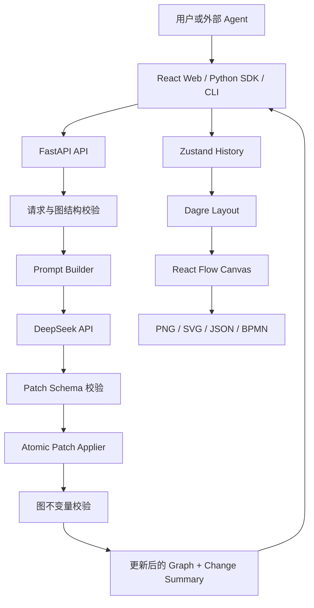

# 智能流程图 Agent 实施规格

> 文档状态：可开发基线 1.0
> 来源：`Untitled document.docx`
> 目标读者：产品负责人、前端工程师、后端工程师、测试工程师、部署人员
> 首版周期：4 周，按 1 名前端 + 1 名后端 + 兼职测试估算

## 1. 项目定义

### 1.1 目标

构建一个面向 SAP 业务流程建模场景的 Web 流程图 Agent。用户通过中文自然语言持续创建和修改流程图，系统把指令转换为可审计的增量 Patch，经校验后更新画布，并支持撤销、重做和多格式导出。

系统同时提供 HTTP API、Python SDK 和 CLI，使 Codex、Cursor 或其他 Agent 能把流程图修改能力作为工具调用。

### 1.2 目标用户

- SAP 实施顾问：在需求访谈中快速整理订单、采购、库存和财务流程。
- 业务分析师：通过对话逐步完善业务流程和条件分支。
- 开发人员：通过 API、SDK 或 CLI 生成和维护结构化流程图。
- 运维人员：通过 Docker Compose 部署单机或团队内部实例。

### 1.3 核心成功标准

- 连续 10 轮修改中，正确保留未被指令涉及的节点和连线。
- 合法指令的拓扑修改正确率不低于 90%。
- 非流式请求从提交到画布更新的 P95 小于 5 秒，目标区间为 2 至 4 秒。
- 任一非法 Patch 均不得造成部分更新。
- JSON 导出后可完整恢复节点、连线、版本和画布布局。
- PNG 和 SVG 导出无截断，2 倍分辨率下文字清晰。

## 2. 范围与优先级

### 2.1 MVP 必须交付

- 文本指令创建流程图。
- 基于当前图的多轮增量修改。
- 支持开始、结束、任务、判断和子流程五类节点。
- 支持增加、删除、修改节点以及增加、删除连线。
- React Flow 画布、缩放、平移、框选和节点选中。
- Dagre 自动布局和更新动画。
- 撤销、重做，最多保留 50 个历史版本。
- 导入和导出 JSON。
- 导出 PNG、SVG。
- 导出受限 BPMN 2.0 XML。
- DeepSeek API 接入。
- HTTP API、Python SDK 和 CLI。
- Docker Compose 单机部署。
- 中英文错误提示，首版 UI 默认中文。

### 2.2 MVP 可选交付

- 浏览器 Web Speech API 语音转文字；不支持时自动隐藏麦克风入口。
- SSE 推送 `accepted`、`calling_model`、`validating`、`completed` 等状态。
- 浅色和深色主题。

### 2.3 后续版本

- Whisper 服务端语音识别。
- 多用户账号、项目空间和服务端持久化。
- 实时协作和冲突合并。
- ELK 增量布局。
- 泳道、组织角色、数据对象和完整 BPMN 语义。
- SAP OData、RFC、CPI 或 Signavio 集成。
- 自定义节点模板和企业级 Prompt 配置。

### 2.4 明确不做

- 首版不直接连接 SAP 系统，也不读取生产业务数据。
- 首版不支持多人同时编辑同一张图。
- 首版不保证任意流程图可无损转换为完整 BPMN 模型。
- 不向前端展示模型内部推理过程，只返回简短的变更摘要。
- 不允许浏览器直接持有 DeepSeek API Key。

## 3. 固化技术选型

| 层级 | 技术 | 用途 |
| --- | --- | --- |
| Web | React、TypeScript、Vite | 前端应用 |
| 画布 | `@xyflow/react` | 节点和连线交互 |
| 布局 | `@dagrejs/dagre` | 首版拓扑自动布局 |
| 状态 | Zustand | 当前图、历史栈和请求状态 |
| 前端校验 | Zod | 导入文件和本地状态校验 |
| 图片导出 | `html-to-image` | PNG、SVG 导出 |
| API | FastAPI、Pydantic 2 | HTTP 服务和结构校验 |
| HTTP 客户端 | HTTPX | 调用 DeepSeek 兼容接口 |
| 日志 | structlog | 结构化服务日志 |
| SDK | Python 3.12 | Python SDK 和 CLI |
| 测试 | Vitest、React Testing Library、Playwright、pytest | 单元、组件、端到端测试 |
| 部署 | Docker、Docker Compose、Nginx | 静态站点和 API 部署 |

版本原则：Node.js 使用当前 LTS，Python 固定为 3.12；依赖通过锁文件固定，不在生产构建中使用浮动版本。

## 4. 总体架构



### 4.1 关键设计原则

1. 后端在 MVP 中保持无状态。每次请求携带当前图，响应返回完整更新图。
2. LLM 只提出 Patch，不直接覆盖当前图，也不生成画布坐标。
3. Patch 在图副本上原子执行；任何操作失败时整批拒绝。
4. 节点和连线的永久 ID 由后端生成，不能信任模型提供的 ID。
5. 前端只接受与当前 `base_version` 匹配的响应，防止慢请求覆盖新状态。
6. 业务质量问题返回警告，结构完整性问题直接拒绝。
7. Prompt、模型适配、Patch 应用和布局互相隔离，便于独立替换和测试。

## 5. 仓库结构

```text
flowchart-agent/
├─ apps/
│  ├─ web/
│  │  ├─ src/
│  │  │  ├─ api/                 # 自动生成的 OpenAPI 客户端和封装
│  │  │  ├─ components/          # 工具栏、输入栏、弹窗
│  │  │  ├─ flow/                # 节点、边、布局和画布
│  │  │  ├─ stores/              # Zustand store 和 history
│  │  │  ├─ export/              # PNG、SVG、JSON 导入导出
│  │  │  └─ tests/
│  │  ├─ package.json
│  │  └─ vite.config.ts
│  └─ api/
│     ├─ app/
│     │  ├─ api/routes/           # modify、export、health
│     │  ├─ core/                 # settings、logging、errors
│     │  ├─ models/               # Pydantic 请求、图和 Patch 模型
│     │  ├─ agent/                # prompt、provider、response parser
│     │  ├─ graph/                # patch applier、validators、ID factory
│     │  ├─ export/               # BPMN 转换
│     │  └─ main.py
│     ├─ tests/
│     └─ pyproject.toml
├─ sdk/
│  └─ python/
│     ├─ flowchart_agent_sdk/
│     ├─ tests/
│     └─ pyproject.toml
├─ contracts/
│  ├─ examples/                   # 合法和非法请求、响应样例
│  └─ openapi.json                # CI 从 FastAPI 生成，禁止手工编辑
├─ prompts/
│  ├─ system.v1.md
│  └─ examples.v1.json
├─ deploy/
│  ├─ nginx.conf
│  └─ docker-compose.yml
├─ .env.example
├─ Makefile
├─ README.md
└─ IMPLEMENTATION.md
```

后端 Pydantic 模型是 API 契约的唯一事实来源。CI 从 FastAPI 生成 `contracts/openapi.json`，再生成前端 TypeScript 类型；若生成结果与仓库不一致，CI 失败。

## 6. 数据模型

### 6.1 GraphDocument

```json
{
  "schema_version": "1.0",
  "graph_id": "01JFLOWCHART00000000000001",
  "version": 3,
  "title": "销售订单审批流程",
  "direction": "TB",
  "nodes": [
    {
      "id": "01JNODE0000000000000000001",
      "type": "start",
      "label": "开始",
      "description": null
    },
    {
      "id": "01JNODE0000000000000000002",
      "type": "task",
      "label": "提交销售订单",
      "description": null
    }
  ],
  "edges": [
    {
      "id": "01JEDGE0000000000000000001",
      "source": "01JNODE0000000000000000001",
      "target": "01JNODE0000000000000000002",
      "label": null
    }
  ],
  "layout": {
    "01JNODE0000000000000000001": {"x": 200, "y": 40},
    "01JNODE0000000000000000002": {"x": 200, "y": 160}
  }
}
```

字段约束：

| 字段 | 约束 |
| --- | --- |
| `schema_version` | 首版固定为 `1.0` |
| `graph_id` | ULID；新图由前端或后端 SDK 生成 |
| `version` | 非负整数；每次成功修改后加 1 |
| `title` | 1 至 100 个字符 |
| `direction` | `TB` 或 `LR` |
| `nodes` | 最多 500 个 |
| `edges` | 最多 1000 条 |
| `layout` | 可选；不发送给 LLM；JSON 导入导出时保留 |

节点类型固定为：

- `start`：流程开始。
- `end`：流程结束。
- `task`：普通业务处理动作。
- `decision`：条件判断。
- `subprocess`：可展开的子流程引用，MVP 中只显示为特殊节点。

### 6.2 LLM Patch

LLM 新增节点时使用请求内临时引用 `ref`。后端把临时引用转换为永久 ULID，因此模型不需要猜测 ID，新节点之间仍可以在同一批操作中连线。

```json
{
  "change_summary": "在订单提交后增加信用检查，并根据结果分流。",
  "operations": [
    {
      "op": "add_node",
      "ref": "credit_check",
      "node": {
        "type": "decision",
        "label": "信用检查",
        "description": null
      }
    },
    {
      "op": "add_edge",
      "edge": {
        "source": "01JNODE0000000000000000002",
        "target": "@credit_check",
        "label": null
      }
    }
  ]
}
```

操作联合类型：

```text
add_node    { op, ref, node: { type, label, description? } }
remove_node { op, id }
update_node { op, id, changes: { type?, label?, description? } }
add_edge    { op, ref?, edge: { source, target, label? } }
remove_edge { op, id }
```

引用规则：

- 已存在节点必须使用当前图中的永久 ID。
- 当前 Patch 新增节点使用 `@<ref>` 引用。
- `ref` 只能由小写字母、数字和下划线组成，在一次响应内唯一。
- 永久 ID 和 `layout` 字段不暴露为模型可修改字段。
- `update_node.changes` 至少包含一个字段。
- 单次 Patch 最多 100 个操作。

### 6.3 API 响应

```json
{
  "request_id": "01JREQUEST00000000000000001",
  "base_version": 3,
  "graph": {
    "schema_version": "1.0",
    "graph_id": "01JFLOWCHART00000000000001",
    "version": 4,
    "title": "销售订单审批流程",
    "direction": "TB",
    "nodes": [],
    "edges": [],
    "layout": {}
  },
  "applied_patch": {
    "change_summary": "在订单提交后增加信用检查，并根据结果分流。",
    "operations": []
  },
  "warnings": [],
  "metrics": {
    "provider": "deepseek",
    "model": "configured-model",
    "attempts": 1,
    "latency_ms": 2430
  }
}
```

`metrics` 不包含 Prompt 正文、API Key 或完整用户业务数据。

## 7. Patch 应用规则

### 7.1 执行顺序

1. 校验请求体、字符长度、节点数量和版本格式。
2. 从 `GraphDocument` 提取不含坐标的 `SimplifiedGraph`。
3. 构建 Prompt 并调用模型。
4. 按 Pydantic 判别联合类型解析 `operations`。
5. 解析临时引用并生成节点、连线 ULID。
6. 深拷贝当前图，在副本中顺序执行全部操作。
7. 检查引用完整性、重复 ID、重复边和资源上限。
8. 生成业务质量警告。
9. 将版本加 1，返回新图和已规范化的 Patch。

### 7.2 原子性

- 任一操作失败，整批 Patch 失败，原图不变。
- `remove_node` 自动删除所有入边和出边，并把实际删除的边写入规范化 Patch。
- 删除不存在的节点或连线属于错误，不静默忽略。
- 更新不存在的节点属于错误。
- 禁止自连接边，除非后续通过配置显式开放。
- `source`、`target`、`id` 只能指向当前图或同一 Patch 中已经声明的引用。

### 7.3 硬校验和软校验

硬校验失败时返回 `422`：

- ID 重复或引用不存在。
- 节点、连线或操作数量超过上限。
- 节点类型或操作类型不受支持。
- 标签为空或超过 200 个字符。
- 出现完全重复的 `source + target + label` 连线。
- Patch 解析失败或包含未声明字段。

软校验只产生 `warnings`：

- 缺少开始或结束节点。
- 存在不可从开始节点到达的节点。
- 存在没有任何连线的孤立节点。
- 判断节点少于两条出边。
- 非判断节点存在多条带条件标签的出边。
- 流程中存在环。

流程图允许业务回退形成环，因此环只能告警，不能作为结构错误拒绝。

## 8. API 设计

### 8.1 修改流程图

`POST /api/v1/flowcharts/modify`

请求：

```json
{
  "request_id": "01JREQUEST00000000000000001",
  "current_graph": {},
  "instruction": "在订单审批后增加信用检查，检查不通过时结束流程。",
  "locale": "zh-CN"
}
```

要求：

- `request_id` 用作幂等键，重复请求在短时间缓存命中时返回相同结果。
- `instruction` 长度为 1 至 4000 个字符。
- 同一前端会话同一时间只允许一个修改请求。
- 前端收到响应后比较 `base_version`；不匹配时丢弃响应并提示状态已变化。

### 8.2 BPMN 导出

`POST /api/v1/exports/bpmn`

- 请求体为 `GraphDocument`。
- 响应类型为 `application/xml`。
- `start` 映射 `startEvent`，`end` 映射 `endEvent`，`task` 映射 `task`，`decision` 映射 `exclusiveGateway`，`subprocess` 映射 `subProcess`。
- 首版只保证 XML Schema 合法和受支持节点可导入，不承诺泳道、并行网关、补偿和消息事件语义。

### 8.3 健康检查

- `GET /health/live`：进程存活时返回 200。
- `GET /health/ready`：配置完整且模型服务基础配置可用时返回 200；不得在每次探测中产生付费模型调用。

### 8.4 可选 SSE

`POST /api/v1/flowcharts/modify/stream`

事件只能包含阶段状态和最终结果：

```text
accepted -> calling_model -> validating -> applying -> completed
```

不得发送模型思维链或包含敏感业务数据的调试信息。

### 8.5 错误格式

```json
{
  "error": {
    "code": "PATCH_REFERENCE_NOT_FOUND",
    "message": "Patch 引用了不存在的节点。",
    "request_id": "01JREQUEST00000000000000001",
    "details": {"operation_index": 2, "reference": "node-x"}
  }
}
```

| HTTP 状态 | 场景 |
| --- | --- |
| `400` | JSON 无法解析、请求格式错误 |
| `409` | 幂等键与不同请求内容冲突 |
| `422` | 图或 Patch 语义校验失败 |
| `429` | 本地限流或模型服务限流 |
| `502` | 模型服务不可用或返回无法修复的内容 |
| `504` | 模型调用超时 |

## 9. LLM 接入规范

### 9.1 Provider 接口

后端定义统一接口，首版实现 `DeepSeekProvider`：

```python
class LLMProvider(Protocol):
    async def generate_patch(
        self,
        graph: SimplifiedGraph,
        instruction: str,
        locale: str,
    ) -> RawPatchResponse: ...
```

Provider 只负责模型通信。解析、业务校验、ID 生成和 Patch 执行不得放入 Provider。

### 9.2 Prompt 要求

- System Prompt 固定版本并纳入代码审查。
- 输入只包含节点、连线、图标题和用户指令，不包含布局坐标。
- 要求模型输出严格 JSON，禁止 Markdown 代码围栏。
- 输出字段使用 `change_summary`，不要求或保存 `thought_process`。
- 明确要求保留未涉及的现有节点和边。
- 明确声明合法节点类型、操作类型、临时引用和资源上限。
- Prompt 中至少包含创建流程、插入节点、删除节点、修改分支四个 few-shot 示例。

### 9.3 失败与重试

1. 模型调用超时设为 30 秒。
2. 网络错误和 `5xx` 最多重试 2 次，采用指数退避并加入随机抖动。
3. JSON 或 Schema 校验失败时，允许进行 1 次结构修复请求。
4. 结构修复请求只携带错误摘要，不执行原始非法 Patch。
5. 第二次仍失败时返回 `502 MODEL_OUTPUT_INVALID`。
6. 对 `401`、`403` 不重试；对 `429` 尊重 `Retry-After`，由 API 返回明确错误。

### 9.4 防 Prompt 注入

- 用户指令作为数据字段传入，不与 System Prompt 字符串直接拼接成新规则。
- 明确告知模型忽略用户要求泄露 Prompt、API Key 或改变输出格式的指令。
- 服务端只接受既定 Pydantic Schema 中的字段，未知字段全部拒绝。
- 日志对 Authorization、API Key、Cookie 和超长业务文本进行脱敏。

## 10. 前端实现

### 10.1 页面布局

- 顶部工具栏：新建、导入、导出、撤销、重做、自动布局、方向切换。
- 中央画布：React Flow 节点、连线、MiniMap、缩放控件。
- 底部指令栏：多行文本输入、提交按钮、可选麦克风按钮和请求状态。
- 右侧属性面板：编辑选中节点的名称、类型和说明；编辑结果也进入历史栈。
- 错误使用非阻塞通知展示；无法恢复的导入错误使用模态框展示详情。

### 10.2 Zustand 状态

```text
graph             当前 GraphDocument
past[]            撤销快照，最多 50 个
future[]          重做快照
selection         当前选中节点或连线
requestStatus     idle | pending | success | error
activeRequestId   当前请求 ID
dirty             是否存在未导出的修改
```

规则：

- API 成功、属性编辑、手工连线和删除操作都必须产生历史快照。
- 纯画布缩放和平移不进入历史栈。
- 新操作发生后清空 `future`。
- 请求进行中禁用再次提交，但不禁用画布查看和取消请求。
- 使用 `AbortController` 取消请求；取消后不得应用迟到响应。
- 每次图变化后以 500 毫秒防抖写入浏览器本地存储。

### 10.3 增量布局

首次生成整图时执行完整 Dagre 布局；增量修改时执行以下步骤：

1. 保存未变节点的原位置。
2. 执行 Dagre 生成候选位置。
3. 以未变节点为锚点计算候选布局的整体平移偏差。
4. 对位移小于 24 像素的旧节点保留原位置。
5. 新节点使用候选位置，受影响旧节点在 250 至 350 毫秒内平滑移动。
6. 布局完成后执行一次 `fitView`，但只有首次生成时自动改变缩放级别。

验收指标：普通新增一个节点时，至少 80% 的未变节点位移不超过 120 像素，且画布不能全量闪白或重新挂载。

### 10.4 导入导出

- JSON：导入前用 Zod 校验；成功后生成一个历史快照。
- PNG：默认 2 倍像素比，可选透明或白色背景。
- SVG：保留矢量文字和节点边框。
- BPMN：调用后端接口下载 `.bpmn` 文件。
- 导出范围以全部节点包围盒加 32 像素边距计算，不能依赖当前视口。
- 文件名格式：`<安全化标题>-<YYYYMMDD-HHmm>.<扩展名>`。

### 10.5 语音输入

- 浏览器支持 Web Speech API 时显示麦克风按钮。
- 点击开始、再次点击停止；录音状态必须有明确视觉反馈。
- 识别结果只填入输入框，不自动提交。
- 权限拒绝、无设备、识别超时都不影响文本输入。

## 11. Python SDK 与 CLI

### 11.1 SDK 接口

```python
from flowchart_agent_sdk import FlowchartClient

client = FlowchartClient(
    base_url="http://localhost:8000",
    timeout=40.0,
)

result = client.modify(
    current_graph=graph,
    instruction="创建包含订单提交、信用检查和出库的流程",
)

print(result.graph)
print(result.applied_patch.change_summary)
```

SDK 只调用服务端 API，不在本地重复 Prompt 和 Patch 逻辑。SDK 提供同步和异步客户端，并将 API 错误映射为带 `code`、`request_id` 和 `details` 的异常。

### 11.2 CLI

```bash
flowchart-agent modify \
  --graph ./order-flow.json \
  --instruction "在信用检查后增加经理审批" \
  --output ./order-flow.updated.json
```

CLI 要求：

- 默认不覆盖输入文件。
- `--output -` 时向标准输出打印 JSON，日志写入标准错误。
- 失败时返回非零退出码。
- 支持通过 `FLOWCHART_AGENT_URL` 配置服务地址。
- 不通过命令行参数接收 DeepSeek API Key。

## 12. 配置与部署

### 12.1 环境变量

`.env.example` 必须包含：

```dotenv
APP_ENV=development
APP_HOST=0.0.0.0
APP_PORT=8000
LOG_LEVEL=INFO
DEEPSEEK_API_KEY=
DEEPSEEK_BASE_URL=https://api.deepseek.com
DEEPSEEK_MODEL=<configured-model>
LLM_TIMEOUT_SECONDS=30
LLM_MAX_RETRIES=2
MAX_GRAPH_NODES=500
MAX_GRAPH_EDGES=1000
MAX_PATCH_OPERATIONS=100
CORS_ORIGINS=http://localhost:5173
```

API Key 只注入 API 容器，不得出现在 Web 构建参数、前端环境变量、日志或 Docker 镜像层中。

### 12.2 Docker Compose

Compose 包含：

- `web`：Nginx 托管构建后的前端，并反向代理 `/api`。
- `api`：以非 root 用户运行 FastAPI。
- 健康检查和依赖启动顺序。
- 只挂载必要配置，不挂载宿主机源码到生产容器。

启动命令：

```bash
docker compose -f deploy/docker-compose.yml up --build
```

本地默认地址：

- Web：`http://localhost:8080`
- API 文档：仅开发环境开放 `http://localhost:8000/docs`

## 13. 可观测性与安全

### 13.1 日志字段

每个 API 请求记录：

- `timestamp`
- `level`
- `request_id`
- `route`
- `status_code`
- `latency_ms`
- `graph_node_count`
- `graph_edge_count`
- `patch_operation_count`
- `provider`
- `model`
- `provider_attempts`
- `error_code`

默认不记录完整图、用户指令、Prompt、模型原始响应和认证头。开发环境如需调试，必须显式开启并先做脱敏。

### 13.2 最低安全要求

- 生产环境限制 CORS 来源，禁止 `*`。
- Nginx 和 API 同时设置请求体大小上限。
- 每个来源设置基础速率限制，默认每分钟 30 次修改请求。
- 返回通用上游错误，不把 Provider 堆栈或响应头暴露给客户端。
- 容器以非 root 用户运行，依赖镜像使用固定摘要或明确版本。
- CI 执行依赖漏洞扫描和密钥扫描。

## 14. 测试策略

### 14.1 后端单元测试

必须覆盖：

- 五种 Patch 操作的成功路径。
- 删除节点时级联删除入边和出边。
- 新节点临时引用解析和永久 ID 生成。
- 重复引用、缺失引用、重复边和未知字段。
- Patch 中途失败时原图保持不变。
- 版本号只在成功时加 1。
- 图规模和字段长度边界。
- 环、孤立节点、缺少开始/结束节点的告警。
- DeepSeek 超时、限流、非法 JSON 和一次修复重试。
- BPMN XML Schema 校验和节点类型映射。

Patch Applier 和图校验器的行覆盖率不得低于 90%。

### 14.2 前端单元和组件测试

- Zustand 撤销、重做和 50 条历史上限。
- API 迟到响应不覆盖更高版本。
- 请求取消后不更新图。
- JSON 导入校验和错误反馈。
- 导出范围使用全部节点包围盒。
- 不支持语音 API 时隐藏麦克风按钮。
- 节点属性编辑产生历史记录。

### 14.3 端到端测试

Playwright 至少覆盖：

1. 从空画布生成订单审批流程。
2. 连续增加节点、改名、删除节点并撤销、重做。
3. 10 轮固定指令回归，校验未涉及节点 ID 保持不变。
4. 导出 JSON、清空画布、重新导入并比较图结构。
5. 导出 PNG，校验图片非空且尺寸覆盖所有节点。
6. 模型服务返回错误时保留当前画布并显示可理解提示。
7. 桌面和移动视口中工具栏、指令栏不遮挡画布操作。

E2E 默认使用可重复的 Fake Provider，不依赖付费模型。真实 DeepSeek 冒烟测试通过单独的手工或受控 CI 任务执行。

### 14.4 Prompt 回归集

在 `prompts/evals/` 维护至少 30 个固定案例：

- 从零创建线性流程。
- 插入前置和后置节点。
- 修改节点名称和类型。
- 增加通过/拒绝分支。
- 删除节点并重新连接前后节点。
- 含歧义指令时只做最小修改。
- 诱导模型输出 Markdown、泄露 Prompt 或全量重建的攻击指令。

每个案例记录输入图、指令、允许变更集合和禁止变更集合。合并前必须运行结构化评估，未涉及节点 ID 保留率必须为 100%。

## 15. 四周实施计划

### 第 1 周：协议和核心引擎

任务：

- [ ] 初始化仓库、前后端工程、格式化和 CI。
- [ ] 完成 Pydantic `GraphDocument`、Patch 联合类型和 OpenAPI 导出。
- [ ] 完成 ULID 工厂、临时引用解析和 Atomic Patch Applier。
- [ ] 完成图硬校验、软告警和结构化错误。
- [ ] 实现 DeepSeek Provider、Prompt v1、超时和重试。
- [ ] 建立 Fake Provider 和至少 20 个后端单元测试。

退出标准：

- 通过 API 对同一张图连续执行 5 轮固定修改。
- 任一非法 Patch 不改变原图。
- 未涉及节点的永久 ID 全部保留。
- OpenAPI 可生成并被 CI 校验。

### 第 2 周：Web 画布和状态管理

任务：

- [ ] 完成五类自定义节点和连线样式。
- [ ] 完成工具栏、指令栏、属性面板和加载、空、错误状态。
- [ ] 接入 Dagre 首次布局和锚点增量布局。
- [ ] 完成 Zustand 历史栈、撤销、重做和本地恢复。
- [ ] 接入 modify API，处理取消和迟到响应。
- [ ] 完成组件测试和桌面、移动响应式检查。

退出标准：

- 可从空白生成流程，并通过至少 5 轮文本指令修改。
- 新增节点时画布不闪白，未变节点位移符合第 10.3 节指标。
- 撤销和重做可恢复拓扑及位置。

### 第 3 周：导出、语音和工具接入

任务：

- [ ] 完成 JSON 导入导出和 Schema 校验。
- [ ] 完成 PNG、SVG 全图导出。
- [ ] 完成受限 BPMN 转换和 XML 测试。
- [ ] 完成 Python 同步、异步 SDK。
- [ ] 完成 CLI 和 Codex Function Calling 示例。
- [ ] 在兼容浏览器中完成 Web Speech API 输入。
- [ ] 可选完成 SSE 状态流。

退出标准：

- JSON 往返后图结构和位置完全一致。
- PNG、SVG 无截断。
- BPMN 可被至少一个目标 BPMN 工具导入。
- SDK 和 CLI 使用同一 API 完成修改。

### 第 4 周：集成、评估和交付

任务：

- [ ] 完成 30 个 Prompt 回归案例和 10 轮连续修改测试。
- [ ] 完成 Playwright 主流程测试和导出测试。
- [ ] 完成 Dockerfile、Nginx 和 Docker Compose。
- [ ] 完成限流、CORS、日志脱敏和安全扫描。
- [ ] 完成 README、配置说明、API 示例和故障排查。
- [ ] 使用真实 DeepSeek API 进行受控验收测试。

退出标准：

- 所有 P0 用例通过，无阻断级缺陷。
- 真实模型拓扑修改正确率达到 90%。
- Docker Compose 在干净环境可一条命令启动。
- API Key 不出现在前端包、日志和镜像历史中。

## 16. Definition of Done

一个功能只有同时满足以下条件才算完成：

- 实现与本规格一致，异常路径有明确处理。
- 代码通过格式化、静态检查、类型检查和单元测试。
- 影响用户流程的功能具备 Playwright 覆盖或书面手工验收步骤。
- API 变化已更新 OpenAPI、SDK 和示例。
- UI 在 1440 x 900、1024 x 768 和 390 x 844 视口完成检查。
- 不泄露 API Key、Prompt、认证头和模型内部推理。
- 日志包含 `request_id`，错误可定位。
- README 或相关文档已同步。

## 17. 最终验收清单

### 功能

- [ ] 空画布可根据自然语言生成完整流程。
- [ ] 可在已有节点前后插入新节点。
- [ ] 可修改节点名称和类型。
- [ ] 删除节点后相关连线正确处理。
- [ ] 判断节点可生成带标签的分支。
- [ ] 连续 10 轮修改不会误删未涉及节点。
- [ ] 撤销、重做和本地恢复正常。
- [ ] JSON、PNG、SVG、BPMN 导出正常。
- [ ] Python SDK 和 CLI 调用正常。

### 稳定性与性能

- [ ] 非法 Patch 不产生部分更新。
- [ ] 模型超时、限流和非法输出有明确错误。
- [ ] P95 端到端响应时间小于 5 秒。
- [ ] 500 节点上限内导入和基础交互不崩溃。
- [ ] 增量布局无全屏闪烁和明显跳动。

### 部署与安全

- [ ] Docker Compose 可在干净主机启动。
- [ ] 生产 CORS、请求大小和速率限制已配置。
- [ ] API Key 仅存在于后端运行环境。
- [ ] 日志默认不包含完整业务图和用户指令。
- [ ] 镜像使用非 root 用户并通过依赖漏洞扫描。

## 18. 首个可开发切片

第一批代码不应从完整 UI 开始。建议按以下顺序提交：

1. Pydantic 数据模型和合法、非法 JSON 样例。
2. 不依赖 LLM 的 Atomic Patch Applier 及单元测试。
3. Fake Provider 和 `/api/v1/flowcharts/modify`。
4. DeepSeek Provider 和 Prompt 回归集。
5. 只包含画布、文本框和提交按钮的最小 Web 垂直切片。
6. 在垂直切片稳定后增加历史、导出、语音和部署功能。

完成第 5 步后，项目应当已经能够演示“输入一句话，服务端返回 Patch，画布增量更新”的核心价值；后续功能都以该闭环为基础扩展。
